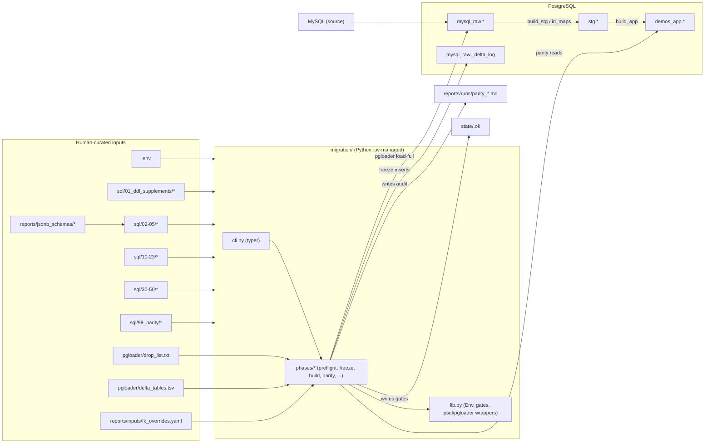

# DEMOS Data Migration

MySQL CMS Medicaid Demonstrations -> DEMOS PostgreSQL warm cutover.

This repo is the executable form of the migration. The single canonical plan
lives in `docs/spec/canonical-spec.adoc` (see the reading guide below).

Comprehensive documentation lives in `docs/` (built with Asciidoctor):

- `docs/README.adoc` — landing page and reading guide.
- `docs/operator/` — playbooks for the solo operator running the cutover.
- `docs/developer/` — guides for engineers extending the pipeline.
- `docs/sme/` — reference and how-to pages for the SME reviewing data decisions.
- `docs/spec/canonical-spec.adoc` — the single canonical migration plan.
- `docs/decks/cutover-day.adoc` — Reveal.js briefing deck.

Build with `cd docs && make html` (or `make all` for HTML + deck).

## Layout

```
migration/        Python package (CLI + phase logic)
  cli.py          Typer entry point: `migrate <phase>`
  lib.py          env, paths, gate state, psql + pgloader wrappers
  duck.py         DuckDB conduit (load-fidelity dual-attach + `analyze` views)
  prisma_schema.py parser for the pinned .prisma model files (FK cross-validation)
  secrets.py      optional AWS Secrets Manager resolver for connection strings
  phases/         one module per phase (preflight, freeze, build, parity, ...)
pgloader/         pgloader load files + manifests
  schema.load     full-load template (rendered to state/schema.rendered.load)
  delta.tmpl.load delta-load template (rendered to state/delta.rendered.load)
  drop_list.txt   table names to skip during full load (human-curated)
  delta_tables.tsv tables to re-pull during delta (human-curated)
sql/              numbered SQL pipeline (run in order)
  00_init/        roles, schemas, extensions, helper fns, _delta_log
  01_ddl_supplements/  migration-private DDL on top of the Prisma artifact (JSONB registry, BN aggregate)
  02_seeds_static/, 03_seeds_limiters/, 04_crosswalks/, 05_id_maps/
  10_stg/         staging transforms
  20_app/, 21_app_associative/, 23_app_derived/
  30_constraints/, 31_constraint_triggers/, 32_app_triggers/
  40_indexes/, 50_sequences/, 99_parity/
scripts/          generate_fk_candidates.sql, cutover.sh shim, mk_pretty.py
                  (Rich `make` output), derivability_audit.py +
                  propose_mappings.py + crosswalk_audit.py (mapping analysis),
                  sql_fmt.py + check_sql_frontmatter.py (SQL hygiene),
                  migrate_local.py (devcontainer load), spin_up.sh +
                  ensure_test_db.sh (local / throwaway Postgres)
tests/            unit tests (lib + phases), live SQL harness (tests/sql,
                  fixtures/fake_demos), integration tier (tests/integration)
reports/          generated artifacts + human-curated decision docs
  fk_overrides.yaml      manual patch layer over generate_fk_candidates.sql
  jsonb_schemas/         JSON Schemas registered in migration.jsonb_schemas
  drop_list.md           narrative behind pgloader/drop_list.txt
  history_strategy.md    history disposition (DEMOS-owned; not migrated)
  pending_approved_decisions.md
  pgm_dtl_tag_mapping.csv crosswalk SME-authored
  notes.md               append-only log of surprises and decisions
  fk_candidates.csv      generated by `migrate fk-candidates`
  parity_*.md            generated by `migrate parity` (audit artifacts)
  pgloader_*.log         generated pgloader stdout/stderr per run
runbooks/         cutover.md, rollback.md, comms/
state/            runtime gate files (preflight.ok, freeze_instant.txt, ...)
docs/             Asciidoctor documentation set (see reading guide above)
docker-compose.test.yml  MySQL + Postgres engines for the integration tier
CHANGELOG.md      release notes (Keep a Changelog; SemVer)
APPS.md           application registry (PMDA/DEMOS app inventory)
CODE_REVIEW.md    standing code-review findings log
.github/workflows/ci.yml
```

## Architecture

The cutover is a layered pipeline. Inputs flow from the left; each layer
reads the previous one and writes the next.



The state directory is the only mutable runtime contract: a phase reads
`state/<prior>.ok`, runs, writes `state/<own>.ok`. Every other file the
phases touch is either source-controlled (the inputs) or generated for
audit (`reports/`, pgloader logs, rendered .load files).

## Sources of truth

These are the **human-curated** files. Every other file in the repo is
either generated, scaffolded, or runtime state. Edit these files in
review-friendly commits with rationale in the commit message.

| File | What it controls | Edited when |
|---|---|---|
| `.env` | Connection strings, healthz URL | Per-environment (never committed) |
| `.env.example` | Template / documentation for `.env` | New variable added |
| `pgloader/drop_list.txt` | Tables skipped during pgloader full load | A MySQL table is decided to be out-of-scope or replaced by a derived form. Narrative goes in `reports/narrative/drop_list.md`. |
| `pgloader/delta_tables.tsv` | Tables re-pulled during cutover-day delta | A new mutable table is added to MySQL after the bulk load |
| `pgloader/schema.load`, `pgloader/delta.tmpl.load` | pgloader templates (CAST rules, ALTER SCHEMA, AFTER LOAD hooks) | Type-coercion or load-shape change |
| `reports/inputs/fk_overrides.yaml` | Manual patch layer over auto-generated FK candidates (target table/column, confidence, notes) | A heuristic FK is wrong, missing, or needs operator confidence assigned. See `migration/phases/fk_candidates.py`. |
| `reports/jsonb_schemas/*.schema.json` | JSON Schemas loaded into the `migration.jsonb_schemas` registry by `migrate seeds`; used as parity oracles (no live `demos_app` trigger) | A registered schema is introduced or its shape changes |
| `reports/narrative/drop_list.md` | Narrative + rationale for `pgloader/drop_list.txt` | Coupled with that file |
| `reports/narrative/history_strategy.md` | History disposition (DEMOS-owned; not migrated) | Strategy changes |
| `reports/narrative/pending_approved_decisions.md` | Open questions awaiting SME / steering decision | Whenever an open question lands or is answered |
| `reports/pgm_dtl_tag_mapping.csv` | SME-authored mapping consumed by the `20_app` tag-assignment transform | New tag introduced |
| `reports/narrative/notes.md` | Append-only log of surprises, decisions, things-to-remember | Surprise occurs |
| `runbooks/cutover.md`, `runbooks/rollback.md` | Operator playbooks (commands + expected output per phase) | Cutover script changes meaningfully |
| `runbooks/comms/*.md` | Stakeholder comms templates (freeze, flip-complete, rollback, decom) | Messaging needs updating |
| `sql/01_ddl_supplements/*` | Migration-private DDL on top of the Prisma artifact (JSONB registry, BN aggregate) | A migration-private object changes (the `demos_app` schema itself is Prisma-owned) |
| `sql/02_seeds_static/*`, `sql/03_seeds_limiters/*` | Repo-authored seed data (only `25_state_region.sql` today; the static-constraint and limiter tables are Prisma-seeded) | New repo-owned reference value |
| `sql/04_crosswalks/*` | SQL that loads SME-authored crosswalks (CSVs) | New crosswalk introduced |
| `sql/10_stg/*` | Stage-shaping transforms | Source/target shape diverges |
| `sql/20_app/*`, `21_app_associative/*`, `23_app_derived/*` | App-layer materialization | New entity / association / derived view |
| `sql/30_constraints/*` | Migration-owned constraint DDL (the Prisma FKs are captured and re-applied by `migrate constraints`) | A migration-owned constraint is added or relaxed |
| `sql/31_constraint_triggers/*`, `sql/32_app_triggers/*` | Constraint triggers + app triggers (added LAST) | Cross-row invariant or audit trigger |
| `sql/40_indexes/*`, `sql/50_sequences/*` | Indexes + sequence resets | Performance / sequence drift |
| `sql/99_parity/*` | Parity SQL consumed by `migrate parity` | New parity dimension |
| `pyproject.toml`, `uv.lock` | Dependencies + lock | Dep change |
| `Makefile` | Operator-facing wrappers around `uv run migrate` | New target |

Generated / runtime files (never edit by hand): `state/*.ok`,
`state/*.rendered.load`, `state/freeze_instant.txt`, `state/fk_violations.csv`,
`reports/runs/parity_*.md`, `reports/runs/diagnose_*.md`, `reports/runs/pgloader_*.log`,
`reports/generated/fk_candidates.csv`, `reports/generated/scope_coverage.csv`,
`reports/schema_snapshot/`, `reports/reference_data/`, `reports/orphans/*.csv`.

## Bootstrap

This project uses [`uv`](https://docs.astral.sh/uv/) for environment + dependency
management. The project venv is created **outside** iCloud-synced paths by
default; see [Environment](#environment) for why.

```sh
cp .env.example .env                # fill in connection strings
make sync                           # uv sync --extra dev (creates the venv + installs)
make test                           # pytest + coverage
make spin_up                        # optional: throwaway local dev Postgres from .env
make init && make ddl               # roles, schemas, extensions, Prisma DDL + supplements
make load_full                      # pgloader pulls MySQL -> mysql_raw (drop list applied)
```

## Commands

Everything runs through `make` targets: thin wrappers around `uv run migrate <phase>` (`uv run` auto-syncs the lockfile, so no manual venv activation). `make help` is the canonical reference, reproduced verbatim below:

```
╭─ Setup ──────────────────────────────────────────────────────────────────────╮
│ sync .........  uv sync (creates .venv + installs project + dev extras)      │
│ clean ........  drop .venv + build artifacts (preserves state/ and reports/) │
│ clean-state ..  drop runtime gate state and pgloader logs (preserves audit   │
│                 reports)                                                     │
│ clean-all ....  clean + clean-state + delete parity reports (destructive)    │
╰──────────────────────────────────────────────────────────────────────────────╯
╭─ Dev ────────────────────────────────────────────────────────────────────────╮
│ test ......................  pytest                                          │
│ lint ......................  ruff check                                      │
│ typecheck .................  ty check                                        │
│ sql-fmt ...................  pg_format the SQL in place (owns all layout +   │
│                              case)                                           │
│ sql-fmt-check .............  fail if any SQL file is not pg_format-clean     │
│ sql-lint ..................  sqlfluff lint (lint-only; never fix)            │
│ sql-frontmatter ...........  check every SQL file has its structured         │
│                              front-matter block                              │
│ sql-check .................  sql-fmt-check + sql-lint + sql-frontmatter      │
│ test-db-up ................  start throwaway pg_jsonschema Postgres for the  │
│                              deeper-layer SQL harness                        │
│ test-db-down ..............  remove the throwaway Postgres container         │
│ spin_up ...................  start a local target Postgres from .env PG_*    │
│                              vars so init/rebuild run                        │
│ spin_down .................  remove the local demos-dev-pg container         │
│ demonstration-flow-trace ..  regenerate the live demonstration               │
│                              migration-flow run                              │
│                              trace + manifest by replaying the pipeline      │
│                              against a                                       │
│                              curated fixture on a throwaway Postgres         │
│                              (resolves                                       │
│                              PG_TEST_DSN like the SQL harness)               │
│ amendment-flow-trace ......  regenerate the live amendment migration-flow    │
│                              run                                             │
│                              trace + manifest by replaying the pipeline      │
│                              against a                                       │
│                              curated fixture on a throwaway Postgres         │
│                              (resolves                                       │
│                              PG_TEST_DSN like the SQL harness)               │
╰──────────────────────────────────────────────────────────────────────────────╯
╭─ Build pipeline ─────────────────────────────────────────────────────────────╮
│ init → ddl → load_full → seeds → crosswalks → id_maps                        │
│ core rebuild order (= make rebuild minus the cutover phases); chain in one   │
│ make invocation, or run each on its own                                      │
│ init .................  migrate init (00_init/)                              │
│ fetch_prisma .........  auxiliary, before ddl -- migrate fetch-prisma (fetch │
│                         + hash-pin the Prisma DDL)                           │
│     ARGS:                                                                    │
│         --verify-only ..  Fetch (or use cache) and verify the SHA256 against │
│                           the pin; does not apply any DDL. Used by CI to     │
│                           detect drift on PRs.                               │
│         --refresh ......  Bypass the local cache and re-fetch from upstream, │
│                           then re-verify the SHA256 against the pin and      │
│                           rebuild the cache. Requires network (and likely    │
│                           GITHUB_TOKEN).                                     │
│ fetch_prisma_schema ..  auxiliary, before ddl -- migrate fetch-prisma-schema │
│                         (fetch + hash-pin the .prisma models)                │
│     ARGS:                                                                    │
│         --verify-only ..  Fetch (or use cache) and verify the SHA256 against │
│                           the pin; does not apply anything. Used by CI to    │
│                           detect drift on PRs.                               │
│         --refresh ......  Bypass the local cache and re-fetch the .prisma    │
│                           model files from upstream, then re-verify the      │
│                           SHA256 against the pin and rebuild the cache.      │
│                           Requires network (and likely GITHUB_TOKEN).        │
│ verify_prod_schema ...  auxiliary, guards ddl -- migrate verify-prod-schema  │
│                         (diff PROD demos_app vs REFERENCE_PG_URL)            │
│     ARGS:                                                                    │
│         --require-empty/--no-require-empty ..  Also assert the target's      │
│                                                non-seeded demos_app tables   │
│                                                are empty (greenfield).       │
│                                                Disable when guarding the     │
│                                                pre-rebuild DROP.             │
│ ddl ..................  migrate ddl (01_ddl/)                                │
│ load_full ............  migrate load-full (pgloader)                         │
│ fk_candidates ........  auxiliary, after load_full -- migrate fk-candidates  │
│ load_fidelity ........  auxiliary, after load_full -- migrate load-fidelity  │
│                         (live vs mysql_raw row counts; non-gating)           │
│     ARGS:                                                                    │
│         --strict ..  Exit non-zero on any source/mysql_raw row-count         │
│                      mismatch. Default is informational (report + WARN       │
│                      only).                                                  │
│ schema_snapshot ......  auxiliary, crosswalk input -- migrate                │
│                         schema-snapshot (MySQL information_schema ->         │
│                         reports/)                                            │
│ reference_data .......  auxiliary, crosswalk input -- migrate reference-data │
│                         (MySQL *_rfrnc rows + views -> reports/)             │
│ crosswalk_audit ......  auxiliary, after crosswalks --                       │
│                         scripts/crosswalk_audit.py (codebase crosswalks vs   │
│                         live PROD; non-gating, ARGS=--strict)                │
│ seeds ................  migrate seeds (02 + 03)                              │
│ crosswalks ...........  migrate crosswalks (04)                              │
│ id_maps ..............  migrate id-maps (05)                                 │
╰──────────────────────────────────────────────────────────────────────────────╯
╭─ Cutover phases (in order) ──────────────────────────────────────────────────╮
│ preflight → freeze → delta → build → history → constraints → parity → flip → │
│ smoke → decom                                                                │
│ run in order; chain them in one make invocation, or run each on its own      │
│     parity ARGS:                                                             │
│         --accept-pending ..  Mark the parity gate green even when checks are │
│                              PENDING. For dress rehearsals only; logs a WARN │
│                              with the pending checks.                        │
│ resume ....  run all remaining                                               │
│ rollback ..  revert flip                                                     │
│ status ....  show gate state                                                 │
│ diagnose ..  read-only triage report (parity + load-fidelity; no gates)      │
╰──────────────────────────────────────────────────────────────────────────────╯
╭─ Devcontainer load ──────────────────────────────────────────────────────────╮
│ migrate-local .........  build in a scratch PG (PG_URL) and ship ONLY        │
│                          demos_app into the DEMOS                            │
│                          devcontainer (DEVCONTAINER_PG_URL); ARGS passes     │
│                          flags                                               │
│                          (e.g. ARGS="--no-build --skip-jsonschema"). See     │
│                          runbooks/demos-devcontainer-load.md                 │
│ migrate-local-verify ..  guard only -- assert the local ../demos migration   │
│                          set matches the                                     │
│                          pinned Prisma manifest (migrate                     │
│                          verify-prisma-local)                                │
╰──────────────────────────────────────────────────────────────────────────────╯
Pass command flags via ARGS, e.g. make fetch_prisma ARGS="--refresh"
```

`./scripts/cutover.sh <phase>` is a thin shim that forwards to `uv run migrate <phase>`.

## Conventions

- **Every hand-written SQL file opens with a structured front-matter block.** The
  authored transform layers (`04_crosswalks`, `10_stg`, `20_app`,
  `21_app_associative`, `23_app_derived`, `31_constraint_triggers`, `99_parity`)
  carry the full `Purpose` / `Inputs` / `Outputs` / `Invariants` / `Refs` set;
  the mechanical bootstrap/seed/id-map layers carry the light `Purpose` / `Refs`
  subset. `make sql-frontmatter` enforces it.
- **`pg_format` owns all SQL layout and case; `sqlfluff` is lint-only.** Never
  hand-format and never `sqlfluff fix`; run `make sql-fmt`, then gate with
  `make sql-check` (fmt-check + lint + front-matter; also a pre-commit hook). See
  `docs/developer/reference-sql-conventions.adoc`.
- **Every file is idempotent, but the mechanism is layer-specific** (re-applying
  on the same `mysql_raw` snapshot yields identical rows):
  - views and functions → `CREATE OR REPLACE`;
  - id-map and bootstrap tables → `CREATE TABLE IF NOT EXISTS`;
  - the id-map and app-layer (`20_app` / `21_*` / `23_*`) data loaders → `INSERT
    ... ON CONFLICT (...) DO NOTHING` (often behind a `WHERE NOT EXISTS`
    pre-filter), chosen over truncate-reload so minted UUIDs and sequence
    `nextval`s stay stable across rebuilds;
  - migration-private aggregates and scratch tables (`migration.bn_workbook_detail`,
    `stg._keep_ids` / `_drop_ids`) → `TRUNCATE` + `INSERT`.
  Data loaders never upsert (no `DO UPDATE`); the lone exception is the static
  `state_region` reference seed, which `DO UPDATE`s to reconcile its own values.
- **Every transform is a guarded no-op until its inputs exist.** A `to_regclass`
  guard makes a loader `RETURN` early (and a parity view `CREATE OR REPLACE` an
  empty stand-in) when a dependency is absent, so any file is safe to apply
  against a partially-built database and the app-layers idempotency harness can
  replay it. App-layer loaders run inside the deferred-constraint `build_app`
  transaction.
- **Parity views are fail-closed:** an integrity/completeness view that is
  non-empty REDs the gate; held-row accounting views are non-gating and log
  per-row to `reports/orphans/*.csv` for SME review.
- **FKs are owned by Prisma:** `migrate ddl` captures them to
  `state/prisma_fks.json` and drops them so the bulk build runs unconstrained,
  then `migrate constraints` re-creates each `NOT VALID`, `VALIDATE`s them
  one-by-one, and applies `30_constraints` → `31_constraint_triggers` →
  `32_app_triggers` → `40_indexes` → `50_sequences`.
- **Triggers are applied last** (in the constraints phase, after the build) so
  they never fire during the load.
- **Each phase is gated and re-runnable:** it requires the prior phase's
  `state/<phase>.ok` file, and re-running it on the same `mysql_raw` snapshot
  produces the same `demos_app` rows.

## Environment

- `uv` 0.11+ 
  - Homebrew: `brew install uv`.
  - Curl: `curl -LsSf https://astral.sh/uv/install.sh | sh`
  - Windows: `powershell -ExecutionPolicy ByPass -c "irm https://astral.sh/uv/install.ps1 | iex"`
- The Makefile pins `UV_PROJECT_ENVIRONMENT` to `~/.venvs/demos-migration` to
  keep the venv out of iCloud-synced paths (e.g. `~/Documents`): iCloud evicts
  files there (the `dataless` flag), which blocks Python startup and hangs every
  `uv run`. Export your own `UV_PROJECT_ENVIRONMENT` to override (CI does).
- Python 3.11 is the canonical target (`requires-python = ">=3.11"`,
  `[tool.ruff] target-version = "py311"`, `[tool.ty.environment]
  python-version = "3.11"`). Newer interpreters work in dev but type
  checking and lint are pinned to 3.11 stdlib semantics; if you run
  Python 3.14 locally that's fine, but CI evaluates against 3.11.
- PostgreSQL 16+ with `pgcrypto`, `uuid-ossp`, `pg_jsonschema`.
- pgloader (Homebrew on macOS).
- DuckDB with `mysql_scanner` and `postgres_scanner` extensions (pre-load source conduit and the non-gating load-fidelity check; parity itself is pure Postgres).

## Testing

Three tiers, increasing in setup cost:

1. **Unit** (default): `make test`. No external services required.
2. **SQL harness** (live Postgres with `pg_jsonschema`): `make test-db-up`,
   build `PG_TEST_DSN` from the `PG_TEST_*` Makefile vars into a gitignored env
   file, source it, then `make test` (or let `PG_TEST_DSN="$(make -s test-db-dsn)"`
   reuse an already-running container). These tests skip without `PG_TEST_DSN`.
3. **Integration** (live MySQL + Postgres): `make compose-up`, export the DSNs
   listed in `docker-compose.test.yml`, then `make integration-test`
   (`uv run pytest -m integration`).

CI runs tiers 1-2 (it provisions a `postgres:16` service for the harness, with a
coverage floor), plus `ruff`, `ty`, and Prisma DDL/schema pin drift checks
(`fetch-prisma[-schema] --verify-only`). The integration tier is local-only.

SQL hygiene (`make sql-check`: pg_format layout + `sqlfluff` lint + structured
front-matter) runs as a pre-commit hook on staged `.sql`; run
`uv run pre-commit install` once. The committed migration-flow trace partials
(demonstration + amendment) are regenerated with `make demonstration-flow-trace`
/ `make amendment-flow-trace`, and the SQL harness fails on drift against them.

## Versioning

Semantic Versioning, driven by [Conventional Commits](https://www.conventionalcommits.org/)
(`feat`/`fix`/`docs`, etc.). The version is pinned in `pyproject.toml` and
`migration/__init__.py` (kept in sync), with notable changes recorded in
`CHANGELOG.md`. Current release: **0.7.0** (tag `v0.7.0`).

`uv.lock` is committed and pins exact versions; `uv sync` is reproducible across machines.
