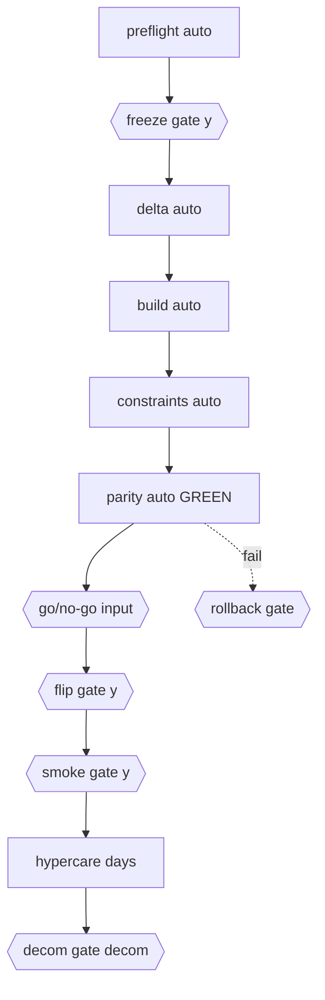

# Jenkins pipelines for data-migration (CI + gated cutover)

> Status: approved spec, not yet implemented.

## Goal
Add two Jenkins pipelines for `data-migration/`, following the existing `pipelines/` conventions and shared library:
1. `Jenkinsfile.data-migration` - automatic CI validation on PR/push.
2. `Jenkinsfile.data-migration-cutover` - manually-triggered, parameterized cutover with human `input` gates that satisfy the CLI's `confirm()` prompts non-locally.

## 1. Shared-library change: add a `python` preset to `kubeBlock`
Edit `pipelines/lib/vars/kubeBlock.groovy`, adding a preset alongside `node`/`aws-cli` etc.:
```groovy
'python': """
- name: python
  image: ${opts.PYTHON_IMAGE ?: 'artifactory.cloud.cms.gov/docker/library/python:3.11-slim-bookworm'}
  command: [cat]
  tty: true
  resources:
    requests: { cpu: 1000m, memory: 2Gi, ephemeral-storage: "2Gi" }
    limits:   { cpu: 2000m, memory: 4Gi, ephemeral-storage: "10Gi" }
"""
```
Each stage installs uv once: `pip install --disable-pip-version-check uv` (from the Artifactory PyPI proxy) and exports `UV_PROJECT_ENVIRONMENT=$WORKSPACE/.uvenv` (the Makefile explicitly says to override this in CI).

## 2. `Jenkinsfile.data-migration` (auto CI)
- Agent: `kubeBlock(containerNames:['python','snyk'])`.
- `options`: `disableConcurrentBuilds(abortPrevious:true)`, `buildDiscarder(retentionPolicy(env.BRANCH_NAME))`.
- `HANDLE_ERRORS` boolean param, `handleError(params.HANDLE_ERRORS){}` around each stage, all gated on `hasChange('data-migration')`.
- Stages (via `dirCon('data-migration','python')`):
  - Sync: `uv sync --extra dev`
  - Lint: `uv run ruff check migration tests`
  - Typecheck: `uv run ty check migration tests`
  - Test: `uv run pytest --cov=migration --cov-report=term-missing` (DB-gated + integration tests skip cleanly with no `*_TEST_DSN`)
  - SQL hygiene: `apt-get install -y pgformatter` then `make sql-check`. **Fallback if pgFormatter is not mirrored in Artifactory:** run `uv run sqlfluff lint ...` + `uv run python scripts/check_sql_frontmatter.py` only, leaving `sql-fmt-check` to the pre-commit hook.
  - Snyk SAST: `snykCodeScan('data-migration')`.
- `post`: `slackPipelineFail('Data Migration')`, `handleError.setFailureDescription()`, `cleanWs(deleteDirs:true)`.

## 3. `Jenkinsfile.data-migration-cutover` (manual, parameterized)
Runs a selectable slice of the runbook and relies on the CLI's own gate-state (`state/*.ok`) + `resume` for continuity across separate runs (no single run spans the T-2h -> Day 7+ timeline).

Parameters: `START_PHASE` and `STOP_PHASE` (choice: `preflight,freeze,delta,build,constraints,parity,flip,smoke,decom`), `ROLLBACK` (boolean, runs the emergency rollback path instead), `DEMOS_ENV` (choice).

State durability (chosen: S3 sync). Before the first phase: `aws s3 sync s3://<bucket>/cutover-state/ data-migration/state/`; after every phase: sync back up. This survives ephemeral pods + `cleanWs` and gives an auditable trail. Uses the existing `assumeRole(accountNumber: <prod acct>)` step.

Non-gated phases (`preflight`,`delta`,`build`,`constraints`,`parity`) run with `MIGRATE_NONINTERACTIVE=1` exported as a guard (they don't prompt today; this makes any accidental prompt die loudly instead of hanging).

Gated phases (`freeze`,`flip`,`smoke`,`decom`,`rollback`) use a **stage-level `input` directive** (evaluated before the pod is allocated, so no executor is held during the human wait) with a `submitter` allowlist, a `timeout`, and a typed token piped to the CLI. `MIGRATE_NONINTERACTIVE` is left unset for these. Tokens: `y` for freeze/flip/smoke, `decom` for decom, `rollback` for rollback.
```groovy
stage('P1 Freeze') {
  when { expression { runPhase('freeze') } }
  input {
    message "DBA confirmed MySQL writes paused + read-only banner up?"
    ok "Run freeze"; submitter "demos-migration-approvers"
    parameter { string(name:'TOKEN', defaultValue:'', description:"Type 'y' to proceed") }
  }
  agent { kubernetes { yaml kubeBlock(containerNames:['python','aws-cli']) } }
  steps { script {
    assumeRole(accountNumber: env.DEMOS_AWS_PROD_ACCOUNT_NUMBER)
    dirCon('data-migration','python') {
      sh 'aws s3 sync s3://$STATE_BUCKET/cutover-state/ state/'
      sh 'printf "%s\\n" "$TOKEN" | uv run migrate freeze'
      sh 'aws s3 sync state/ s3://$STATE_BUCKET/cutover-state/'
    }
  }}
}
```
`flip` additionally requires `NEW_APP_HEALTHZ_URL`; `preflight` requires the pinned Prisma artifact under `state/prisma_ddl/` (restored by the S3 sync). Rollback is a separate gated stage guarded by the `ROLLBACK` param.

### Cutover flow (gates marked)


## Preserved local path
The plan doesn't remove or change any local capability. The existing `uv run migrate <phase>` runbook still works on an operator's machine and stays valuable as a break-glass fallback if Jenkins is unavailable mid-cutover. Jenkins is additive.

## Out-of-repo prerequisites (documented, not implemented)
- Jenkins/CloudBees admin registers both Jenkinsfiles as jobs; creates the `demos-migration-approvers` submitter group.
- Confirm the `python` base image + uv install work against the CMS Artifactory mirror (and whether `pgformatter` is available).
- Jenkins credentials/env for cutover: prod `assumeRole` account, `STATE_BUCKET` (S3), `REFERENCE_PG_URL`, `NEW_APP_HEALTHZ_URL`, `MYSQL_URL`/`MYSQL_*`, `DB_NAME`, `AWS_REGION`, optional `DB_SECRET_NAME`, `GITHUB_TOKEN`.
- Cutover pod needs Java + a pgloader v4 jar (`PGLOADER_JAR`, `JAVA_BIN`) for the `delta` load; add these to the `python`-stage image or install in-stage.
- DEMOS post-Prisma step (`npx tsx src/refreshDbObjects.ts` from the `server/` checkout, after P5 before flip) stays a manual operator step in that other repo; out of scope for these pipelines.

## Validation
No local Jenkins controller, so validate Groovy structurally: check declarative syntax by review against the sibling Jenkinsfiles, and if the Jenkins CLI/`declarative-linter` is reachable, run it. The `data-migration` make targets (`lint`,`typecheck`,`test`,`sql-check`) are already runnable locally to confirm the exact commands the CI stage invokes.

## Files
- Edit: `pipelines/lib/vars/kubeBlock.groovy` (add `python` preset)
- Create: `pipelines/Jenkinsfile.data-migration`
- Create: `pipelines/Jenkinsfile.data-migration-cutover`
