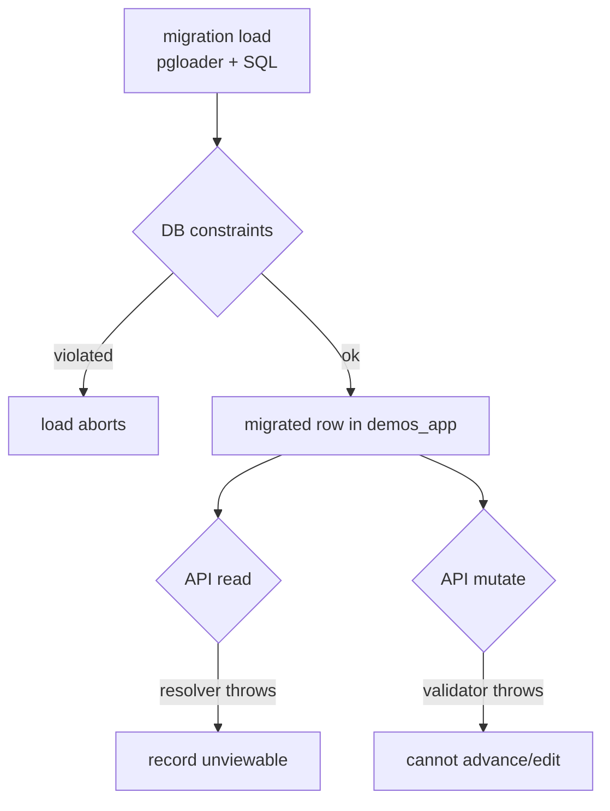

# API-Level Validation Audit & Migration Compliance Spec

**Status**: In progress (audit complete; Tier 0 migration-repo guards built - see §7)
**Date**: 2026-07-20
**Source Spec**: `~/.factory/specs/2026-07-20-api-level-validation-audit-migration-compliance-spec.md`
**Reference session**: `aaa5bae7-696a-4889-99ac-e9ca56d570bb` (phase-date mapping + the
`is_migrated` exemption)
**Reconciles**: `reports/narrative/sme_signoff_2026-07-20.md`,
`docs/specs/pmda-cross-cutting-derivation-spec.md`

> **Purpose**: enumerate every DEMOS API-level validation check, split by *when*
> it fires, map each migration data category to the checks it violates, and give
> concrete fixes. Per the approved plan the actionable fixes are **migration-repo
> only**; DEMOS-server changes are written as ready-to-hand-off cross-repo requests
> (the migration repo cannot merge them).

---

## 1. Method and the two enforcement surfaces

DEMOS enforces data validity on two surfaces that fire at completely different
times. Conflating them is the root of the mis-scoping in the SME ledger.



- **Surface A - DB-enforced** (`server/src/model/**/*.prisma`,
  `server/src/sql/functions.sql`, `model/migrations/**/migration.sql`): NOT NULL,
  `@unique`/`@@unique`, `CHECK`, FK/composite-FK, `dbgenerated()` defaults, and
  INSERT/AFTER-INSERT triggers. These fire on the **direct load** and hard-abort
  it. The migration writes straight to Postgres, so it must satisfy or work
  around every one of these.
- **Surface B - app-enforced** (TypeScript validators, GraphQL resolvers, Zod
  report schemas): fire **only when the DEMOS API later reads or mutates** a
  migrated row. The load bypasses them entirely; they become live only
  post-cutover when operators touch migrated records.

### 1.1 Correction to the SME ledger

`reports/narrative/sme_signoff_2026-07-20.md` §4.5/§8.4 states that 97.7% of
loaded demos "sit in a `Completed` state that DEMOS's own rules call impossible"
and that this **blocks**. Verified against code, this is overstated:

- `checkPhaseCompletionRules` is invoked **only** from `completePhase`
  (`server/src/model/applicationPhase/completePhase.ts:24`), via
  `validatePhaseCompletion`.
- It validates **only the single phase named in the mutation**, and for prior
  phases calls `checkPriorPhaseCompleteForCompletion`, which checks
  `status === "Completed"` **and nothing else** - no retroactive date/document
  re-check (`checkPhaseFunctions.ts:96`).
- No read/list resolver re-runs any completion rule.

So phantom `Completed` phases do **not** break the load and do **not** break
reads. They bite on **forward workflow** (Tier 2). This reclassification is why
the phantom-phase item is downgraded from Tier 0 to Tier 2 below.

### 1.2 The DEMOS application triggers at load time (split state)

A second, decisive correction: the DEMOS **application triggers** are **not part
of the pinned schema the migration loads against**. The migration pins a Prisma
DDL snapshot (`reports/prisma_ddl.sha256` → `state/prisma_ddl/<sha>.sql`) and
loads into that. That pinned artifact contains **no `CREATE TRIGGER` / `CREATE
FUNCTION`** - `create_phases_and_dates_for_new_application`,
`generate_medicaid_chip_id_numbers`, and `check_demonstration_primary_project_officer`
live in `server/src/sql/functions.sql`. Historically all three were deployed only
by DEMOS's `refreshDbObjects.ts` **after P5, before the flip** (after the load).

That is still true for **two** of them, but the medicaid/chip mint trigger split
off. DEMOS made `generate_medicaid_chip_id_numbers` **migration-aware**: gated on
the session GUC `demos_app.migration_mode`, it now *permits* an explicitly-set
`medicaid_id`/`chip_id` (legacy-preserve) and **mints** a `chip_id` from
`chip_id_number_seq` for any row left NULL, instead of unconditionally
`RAISE`-ing. So the migration now **deploys this one trigger itself** - verbatim
from `functions.sql` via `lib.mint_trigger_deploy_sql`, in `init_pg.run_ddl`,
right after the pinned DDL - and runs `build_app` with
`demos_app.migration_mode='on'` (txn-local `pre_sql`). The DuckDB/dbt reference
migration (`data/demos_data_tools/load_staged_data_to_demos_app.py`) uses the
identical pattern: `SET LOCAL demos_app.migration_mode='on'` wrapping the
application+demonstration inserts, with the mint trigger left enabled and
`create_phases_and_dates_for_new_application` disabled.

Consequence for Tier 0:

- **T0.1 (`chip_id` NOT NULL) is resolved by the mint trigger**, not by a schema
  change. The loader still writes NULL for rows with no legacy 21-W number; the
  trigger mints one on insert, so the NOT NULL column is satisfied and **no
  cross-repo DDL relaxation is required**. The loader floors `chip_id_number_seq`
  above every preserved legacy 21-W number *before* the inserts, so minted values
  cannot collide with a preserved `chip_id` (`demonstration_chip_id_key` UNIQUE).
- **T0.4 (medicaid/chip `RAISE EXCEPTION`) is neutralized by migration_mode**: with
  the GUC on, the trigger accepts the loader-supplied ids and only mints the NULLs.
- **T0.2 (phase/date auto-population)** and **T0.3 (primary Project Officer)**
  remain **avoided by deploy order**: their triggers stay ABSENT at load (the
  migration sets phases/roles itself) and are deployed only post-load by
  `refreshDbObjects.ts`.

**Preflight P0.9** now enforces exactly this split trigger state before
`build_app`: `generate_medicaid_chip_id_numbers` **MUST BE PRESENT**, while
`create_phases_and_dates_for_new_application` and
`check_demonstration_primary_project_officer` **MUST BE ABSENT**. There is no
longer a genuine Tier-0 load-abort: T0.1 is covered by the mint trigger and the
demonstration flow-trace harness (`tests/sql/test_demonstration_flow_live.py`)
proves the load completes with `chip_id` NOT NULL intact.

---

## 2. Findings by severity tier

### Tier 0 - Load-time hard constraints

There is **no genuine load-abort today**. Per §1.2, T0.1 (`chip_id` NOT NULL) is
resolved at load by the migration-mode-gated `generate_medicaid_chip_id_numbers`
mint trigger (the migration deploys it and runs `build_app` with
`migration_mode='on'`); T0.4 is neutralized by the same GUC; T0.2/T0.4's phase
and primary-PO triggers stay absent at load (deploy order); T0.3 is a post-load
`AFTER INSERT` trigger that never validates the migrated rows. They are kept in
the table for traceability with their corrected disposition.

| # | Constraint (verbatim where useful) | Where | Disposition (corrected) |
|---|---|---|---|
| **T0.1** | `chip_id String @default(dbgenerated())` NOT NULL + `@@unique([chipId])`; loaders write the legacy 21-W number or `NULL` | `server/.../demonstration/demonstration.prisma:16,40`; `sql/20_app/30_demonstration.sql`, `sql/20_app/31_pending_demonstration.sql` | **RESOLVED at load by the mint trigger** (§1.2). The migration deploys `generate_medicaid_chip_id_numbers` (verbatim from `functions.sql`) and runs `build_app` with `migration_mode='on'`, so NULL `chip_id`s are minted on insert and the NOT NULL column is satisfied - **no cross-repo DDL change needed**. Guarded by **Preflight P0.9** (mint trigger MUST BE PRESENT) and proven by `test_demonstration_flow_live`. P0.8 is now informational. |
| T0.2 | `create_phases_and_dates_for_new_application` AFTER INSERT on `application` auto-inserts all `application_phase` rows (phase 1 = `Started`) **and** a `Concept Start Date` `application_date` | `server/src/sql/functions.sql:170-227` | **AVOIDED by deploy order** (§1.2): trigger absent in the pinned DDL, deployed by `refreshDbObjects.ts` after P5. No PK collision at load. Enforced ABSENT by **Preflight P0.9**. |
| T0.3 | `check_demonstration_primary_project_officer` (AFTER INSERT, DEFERRABLE INITIALLY DEFERRED): every demonstration must have a `primary_demonstration_role_assignment` with `role_id = 'Project Officer'` by commit | `server/src/sql/functions.sql:104-127` | **NOT a load-abort**: trigger deployed post-load, never validates migrated rows; kept ABSENT at load by **Preflight P0.9**. Refocused to **non-gating parity check 22** (`sql/99_parity/57_primary_officer_missing.sql`) - a demo missing a primary PO is logged per-row for SME review, not blocked. |
| T0.4 | `generate_medicaid_chip_id_numbers` (BEFORE INSERT): under `migration_mode='off'` `RAISE EXCEPTION` if `medicaid_id`/`chip_id` is set; `RAISE EXCEPTION` on unknown `state_id`; mints medicaid/chip from the sequences when NULL | `server/src/sql/functions.sql:1637-1684` | **NEUTRALIZED by migration_mode** (§1.2): `build_app` sets `demos_app.migration_mode='on'`, so the trigger accepts the loader's legacy medicaid/chip ids and mints only the NULL `chip_id`s. The migration deploys this trigger itself; **Preflight P0.9** asserts it PRESENT. |

**Guarded today** (mirror-checked by loader hold-backs / fail-closed crosswalks;
documented for completeness, not re-fixed):
`check_demonstration_non_null_fields_when_approved` and the amendment/extension
mirrors, `effective_date < expiration_date`, `demonstration_signature_level_check`
(= `'OA'`, loader hardcodes it), `approved_application_status_limit` (`'Approved'`
only), all `*TypeLimit`/`*StatusLimit` FKs, the non-empty text CHECKs
(`check_non_empty_name`/`_content`/`_s3_path`), and duplicate `medicaid_id`
(`demonstration_medicaid_id_key`).

### Tier 1 - Runtime read-breakers (record unviewable, no user action needed)

| # | Rule | Where | Status |
|---|---|---|---|
| T1.1 | `formatDetailsMessage` dereferences `input.activeExtension!` / `input.note!` for action types `Requested Extension`, `Denied Extension Request`, `Requested Resubmission`, `Manually Changed Due Date` → TypeError on read of the deliverable/document | `server/src/model/deliverableAction/deliverableActionFormattingFunctions.ts:76-92` | **latent** - `deliverable_action` not loaded yet |
| T1.2 | `Deliverable.cmsOwner` / `Document.owner` → `selectUserOrThrow` ("No user found") | `deliverableResolvers.ts:203`, `documentResolvers.ts:165`, `user/queries/selectUserOrThrow.ts:10` | **mitigated** - loader mints `user` rows for owners and holds back any owner lacking one |
| T1.3 | On-demand report `z.array(reportRowSchema).parse(results)` with `.strict()` + `z.enum(...)` + `usDateString`: a single out-of-enum status/division/signature, null-in-string, or unparseable date throws `ON_DEMAND_REPORT_ZOD_ERROR` and fails the **entire** report | `server/src/onDemandReports/runOnDemandReport.ts:16` + configs (e.g. `demonstrationOverviewReportConfig.ts:39-63`) | report-time |

### Tier 2 - Forward-workflow blocks (migrated demo cannot be advanced/edited)

| # | Rule | Where | Trigger |
|---|---|---|---|
| T2.1 | `checkPhaseCompletionRules`: the current `Started` phase's `datesMustExist` / `documentTypesMustExist` must be present | `checkPhaseCompletionRules.ts:17-98`, `checkPhaseFunctions.ts:67,82` | completing the current phase |
| **T2.2** | **`validateInputDates` - the dominant blocker.** `completePhase` calls `validateAndUpdateDates` *after* `validatePhaseCompletion`, and that re-runs `validateInputDates` over the **entire merged existing+new date set** | `completePhase.ts:24-33`, `validateAndUpdateDates.ts:16-33`, `validateInputDates.ts`, `checkInputDateFunctions.ts:80-176` | completing **any** phase, or **any** date edit |
| T2.3 | `validateAllowedDateChangeByPhase`: cannot modify a date tied to a finished phase; `Expected Approval Date` cannot be deleted after SDG Prep complete | `validateAllowedDateChangeByPhase.ts` | editing historical dates (most phases are finished on migrated demos) |

#### Why T2.2 is the dominant forward-workflow blocker

`validateInputDates` iterates every date present in the merged set and, for each,
runs timestamp/ordering/offset checks. Three of its failure modes are guaranteed
to trip on PMDA data:

1. **Exact Eastern-boundary timestamps.** Every date value must be exactly
   Eastern midnight (`Start of Day`) or `23:59:59.999` (`End of Day`)
   (`checkInputDateFunctions.ts:38-77`). Migrated `phase_*_dt` values are not
   normalized to those boundaries.
2. **Missing offset counterpart → hard throw.** `getDateValueFromApplicationDateMap`
   throws when a required counterpart date is absent
   (`checkInputDateFunctions.ts:80-91`). The offset rules are bidirectional (e.g.
   `Completeness Review Due Date` ↔ `State Application Submitted Date` ±15 days;
   `Federal Comment Period Start` ↔ `End` ±30 days). If a migrated demo has one
   side but not the other - common given the sparsity documented in ledger §8.3 -
   the check for the present side throws.
3. **Exact offsets.** Even with both sides present, legacy data almost never
   satisfies the exact 15/30/1-day offsets (`validateInputDates.ts:60-129`).

Because `validateInputDates` runs over the **full existing date set** on *any*
phase completion or date edit, the very first attempt to advance or correct a
migrated demo throws - independently of, and more pervasively than, the
phase-completion date requirement (T2.1). A DEMOS `is_migrated` skip on
`checkPhaseCompletionRules` alone is therefore insufficient; it must also cover
the date-validation path (see 4B.3).

### Tier 3 - Analytics/report drift

Covered by T1.3 (report Zod). No separate items.

---

## 3. Migration data category → violation map

| Category | Surface / tier | Exact check | Where | Disposition |
|---|---|---|---|---|
| demonstration (all) | A / T0.1 | `chip_id` NOT NULL + unique; loader writes legacy 21-W or NULL | `demonstration.prisma:16,40` | Resolved at load by the mint trigger + `migration_mode='on'` (§1.2); no DDL relaxation needed. Preflight P0.9 asserts trigger present (4A.1) |
| demonstration, amendment | A / T0.2 | app trigger auto-creates phases + Concept date → PK collision | `functions.sql:170-227` | Avoided by deploy order (§1.2); Preflight P0.9 asserts trigger absent (4A.1) |
| demonstration | A / T0.3 | primary Project Officer required by commit | `functions.sql:104-127` | Not a load-abort (post-load trigger); non-gating parity check 22 (4A.1) |
| demonstration (legacy IDs) | A / T0.4 | medicaid/chip trigger raises if set unless `migration_mode='on'`; mints NULLs | `functions.sql:1637-1684` | Neutralized by `migration_mode='on'` (§1.2); migration deploys the trigger; Preflight P0.9 (4A.1) |
| application_date (demos) | B / T2.2 | timestamp boundary + offset/ordering | `validateInputDates.ts` | normalize dates (4A.2) + DEMOS skip (4B.3) |
| application_date (amendments) | B / T2.1+T2.2 | amendments get **zero** `application_date` rows; missing counterpart throws | `sql/20_app/36_application_date.sql:37` (demos-only) | DEMOS skip (4B.3); guard (4A.3) |
| application_phase (all) | B / T2.1 | phases stamped `Completed` from status w/o dates/docs | `sql/23_app_derived/50_application_phase.sql:48` | phantom - non-blocking; skip (4B.2) + guard (4A.3) |
| deliverable | B / T1.2 | owner must resolve to a login `User` | `deliverableResolvers.ts:203` | mitigated (owner user rows + hold-back) |
| comments | routing | `crosswalk_comment_origin` empty → author-default fallback | `sql/04_crosswalks/68` | author crosswalk (4A.4) |
| document / deliverable_action / extension | A/B (deferred) | s3_path/owner/application_id NOT NULL; action composite FKs; T1.1 | §5 | forward-looking (§5) |
| users, person | A | `is_migrated_from_pmda`/`has_logged_in` CHECK pair | `20260623222056_add_migrated_user_features` | already flag-gated |
| roles | A / T0.3 | PO/primary role rows | `sql/23_app_derived/30,40` | ensure loaded |
| tags | A | `effective_date < expiration_date` | `21_app_associative/*` | non-positive periods dropped |

---

## 4. Proposed fixes

### 4A. Migration-repo fixes (concrete, implementable here)

**4A.1 - Tier-0 load-time guards (built).** Per §1.2 the phase/primary-PO
triggers are absent from the pinned DDL at load (no PK collision T0.2, no
primary-PO abort T0.3), and the medicaid/chip trigger is now migration-mode-aware:
the migration deploys it and runs `build_app` with `migration_mode='on'`, so it
legacy-preserves the loader ids and mints only NULL `chip_id`s (T0.1/T0.4). The
implemented guards codify that split invariant fail-closed:

- **Preflight P0.8** (`migration/phases/preflight.py`) - **informational** since
  the mint trigger resolves T0.1. Confirms `demos_app.demonstration.chip_id`
  exists and logs its nullability, but no longer `die`s on NOT NULL: the mint
  trigger generates a `chip_id` for the NULL rows during `build_app`, so the
  column may stay NOT NULL.
- **Preflight P0.9** (`migration/phases/preflight.py`) - split-trigger-state
  guard. `generate_medicaid_chip_id_numbers` **MUST BE PRESENT** (the migration
  deploys it; it mints NULL `chip_id`s on insert), while the other two DEMOS app
  triggers (`create_phases_and_dates_for_new_application`,
  `check_demonstration_primary_project_officer`) are **absent** before
  `build_app`, catching the only residual risk (an operator applying
  `functions.sql` early).
- **Non-gating parity check 22** (`sql/99_parity/57_primary_officer_missing.sql`
  + `migration/phases/parity.py`) - T0.3. Logs every loaded demonstration with
  no primary Project Officer to
  `reports/orphans/demonstration_missing_primary_officer.csv` for SME review;
  scoped to the full run (gated on `stg.demonstration_role_assignment_resolved`)
  so the app-layers idempotency harness treats it as a no-op. GREEN by decision:
  the post-load trigger never rejects these rows, so the gap is reported, not
  blocked.

**4A.2 - T2.2 date normalization + consistency guard.** In
`sql/20_app/36_application_date.sql`, normalize every emitted `date_value` to the
exact Eastern boundary the target `date_type` expects (Start-of-Day vs End-of-Day
per `DATE_TYPES_WITH_EXPECTED_TIMESTAMPS`):

```sql
-- start-of-day date types
(date_value AT TIME ZONE 'America/New_York')::date::timestamp
  AT TIME ZONE 'America/New_York'                              AS date_value
-- end-of-day date types: same date at 23:59:59.999 America/New_York
((date_value AT TIME ZONE 'America/New_York')::date + interval '1 day'
  - interval '1 millisecond') AT TIME ZONE 'America/New_York'  AS date_value
```

This removes the timestamp-boundary throw (mode 1 of §2 T2.2). It cannot fix
missing offset counterparts or inexact legacy offsets without fabricating data,
so it pairs with the DEMOS skip (4B.3). Add a **non-gating** parity view
`sql/99_parity/58_application_date_consistency.sql` that flags rows failing the
boundary, the ±15/±30/±1-day offsets, or a missing offset counterpart, so the
residual dependent on the DEMOS skip is quantified rather than silent.

**4A.3 - New non-gating parity checks** (close the visibility gaps the fact-net
misses today):

- `sql/99_parity/59_phantom_phase.sql`: reproduce the phantom-phase count as an
  enforced query - `application_phase` rows stamped `Completed` whose phase's
  `datesMustExist`/`documentTypesMustExist` are unmet. Turns ledger §8.4's
  497-626 prose figure into a check.
- ~~`sql/99_parity/59_chip_id_preload_guard.sql`~~: **superseded by Preflight
  P0.8** (4A.1). The chip_id-nullable assertion moved to preflight so it
  fail-closes *before* the load starts (fail-fast) rather than at the P6 parity
  gate; it couples to the re-pin in 4B.6 the same way.

**4A.4 - Author `crosswalk_comment_origin`** (`sql/04_crosswalks/68_comment_origin.sql`)
with the confirmed values from ledger §5 - `A,C,I → private`, `S,R,B → public` -
replacing the author-type fallback as the primary route while keeping the
fallback as a safety floor (a state-authored comment cannot be `private`).

### 4B. DEMOS-server cross-repo change requests (hand-off; not merged here)

Written as precise requests so the DEMOS team can implement directly.

**4B.1 - `demonstration` migrated-features migration** mirroring
`20260623222056_add_migrated_user_features`:

```sql
ALTER TABLE demos_app.demonstration
  ADD COLUMN is_migrated_from_pmda BOOLEAN NOT NULL DEFAULT false;

-- NOTE: dropping chip_id NOT NULL is NO LONGER REQUIRED. The migration-mode-gated
-- generate_medicaid_chip_id_numbers trigger mints a chip_id for the NULL rows on
-- insert (see §1.2), so chip_id can stay NOT NULL. This block is retained only for
-- historical context; do not apply it.
```

Also gate `demonstration_signature_level_check` on `NOT is_migrated_from_pmda`.
Extend the flag to `amendment`/`extension` for the same reason (amendments carry
no phase dates at all). The chip requirement is already satisfied by the mint
trigger and needs no gating.

**4B.2 - Phase-completion skip.** In `validatePhaseCompletion` /`completePhase`,
early-return the completion rules when the application `is_migrated_from_pmda`,
so migrated demos can still be advanced:

```ts
if (application.isMigratedFromPmda) return; // skip checkPhaseCompletionRules
```

**4B.3 - Date-path skip (the grill finding, required in addition to 4B.2).**
`validateAndUpdateDates` must skip `validateInputDates` and
`validateAllowedDateChangeByPhase` (or run a relaxed mode) for migrated
applications - otherwise 4B.2 alone still throws in the date path when a migrated
demo's stored dates fail the boundary/offset/ordering rules.

**4B.4 - T1.1 null-safety.** Make `formatDetailsMessage` tolerate NULL
`note`/`activeExtension` on historical/migrated actions before the
`deliverable_action` backfill loads (replace the `!` assertions with graceful
fallbacks).

**4B.5 - T1.3 report resilience.** Widen the report Zod enums / coerce nulls (or
filter unparseable rows) so a single migrated row cannot fail an entire report.

**4B.6 - Re-pin.** After any DEMOS ship, the migration re-pins its Prisma DDL
snapshot (`reports/prisma_ddl.sha256` + `state/prisma_ddl/<sha>.sql`).

---

## 5. Deferred entities - forward-looking compliance

`document`, `deliverable_action`, and `extension` are **not loaded today**
(`sql/99_parity/30_scope_coverage.sql:52-57`). Their constraints are the nastiest
in the schema; their future loaders must be designed constraint-aware
(`sql/99_parity/30_scope_coverage.sql:52-57` marks them `DEFERRED`). Marked
deferred - not yet blocking.

- **`document`**: `check_non_empty_s3_path` (`trim(s3_path) != ''`),
  `owner_user_id`/`application_id` NOT NULL, `check_deliverable_null_states`,
  `check_phase_id_deliverable_id_null`, `no_submitted_deliverable_cms_files`.
  Blocked on the S3-path strategy + owner/application_id rules (ledger §4.1-4.3,
  `docs/specs/document-migration.md`).
- **`deliverable_action`**: composite FK
  `(action_type_id, old_status_id, new_status_id) → deliverable_action_configuration`
  (must match one of ~30 seeded triples), plus the 5-column action-type FK
  `(action_type_id, due_date_change_allowed, should_have_note, should_have_user_id, extension_id_optional)`
  and the coupled CHECKs `require_notes_for_user_actions`,
  `require_user_id_for_user_actions`, `require_extension_id_for_extension_actions`.
  Also carries T1.1. Needs the history backfill
  (`docs/specs/pmda-history-tables-derivation-spec.md`).
- **`extension`**: `check_extension_non_null_fields_when_approved`,
  `extension_signature_level_check` (`IN ('OA','OCD')`).

---

## 6. Key considerations

- **Ordering.** No Tier-0 item now blocks a full load: T0.1/T0.4 are handled at
  load by the migration deploying the migration-mode-gated mint trigger and
  running `build_app` with `migration_mode='on'` (§1.2), and T0.2/T0.3 are
  avoided by the `refreshDbObjects.ts` deploy order (their triggers stay absent
  at load). No cross-repo DDL change (former 4B.1 chip_id relaxation) is required
  before load. The Tier 2 items matter only once operators actively work migrated
  demos post-cutover.
- **Trigger deploy order is load-bearing.** The Tier-0 reprieve on T0.2/T0.3
  rests entirely on `refreshDbObjects.ts` running *after* the load (P5→flip), and
  on the migration deploying ONLY the mint trigger (not the whole `functions.sql`)
  before `build_app`. If that order ever changes, those items become live
  load-aborts again; Preflight
  P0.9 is the tripwire that fails closed if the triggers appear early.
- **The date fix is split and neither half suffices alone.** 4A.2 normalizes
  timestamps (removes one of three throw modes) but cannot repair missing offset
  counterparts or inexact legacy offsets without fabricating data, so the DEMOS
  date-path skip (4B.3) is required, not optional.
- **No fabrication.** "X"-source dates stay absent under the exemption; the new
  parity views quantify the residual rather than invent values (consistent with
  ledger §2.5/§4.5).
- **Cross-repo dependency is on the critical path.** Everything Surface-B depends
  on shipping `is_migrated_from_pmda` beyond `users`; until then the migration
  guards (4A.3) keep the gap visible and fail-closed rather than silently
  loading rows DEMOS will later reject.

---

## 7. Build queue

**Done this pass (Tier 0, migration-repo):**

1. Preflight **P0.8** chip_id-nullable fail-closed guard + **P0.9** app-trigger
   absence guard (`migration/phases/preflight.py`; tests in
   `tests/test_preflight.py`) - 4A.1.
2. Non-gating parity **check 22** primary-PO gap
   (`sql/99_parity/57_primary_officer_missing.sql` +
   `migration/phases/parity.py`; tests in `tests/test_parity.py`) - 4A.1.

**Not done in this pass:**

3. Date normalization in `sql/20_app/36_application_date.sql` + non-gating
   `sql/99_parity/58_application_date_consistency.sql` (4A.2) - renumbered off
   57, now taken by the primary-PO view.
4. Non-gating parity `59_phantom_phase.sql` (4A.3). The chip_id preload guard
   (originally `59_*`) is superseded by Preflight P0.8.
5. `crosswalk_comment_origin` authoring (4A.4).
6. Hand off DEMOS requests 4B.1-4B.5; re-pin Prisma DDL after they ship (4B.6).
7. Deferred-entity loaders designed against §5 constraints when
   document/deliverable_action/extension come into scope.
