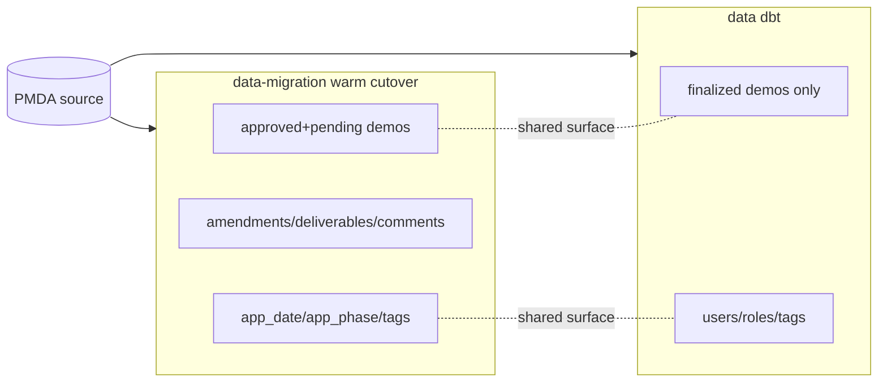

# data-migration / data (dbt) alignment spec

- **Authored:** 2026-07-22
- **Scope:** Alignment analysis of the `data-migration/` warm cutover against the
  `data/` dbt migration.
- **Status:** Report + TODO list. The four `data-migration/` TODOs in §4.1 are
  now **implemented** (2026-07-24; decisions D14-D17 in
  `reports/narrative/pending_approved_decisions.md`); the §4.2 `data/` dbt
  catch-up TODOs are unchanged and out of scope here.
- **Decision basis (session):** The two tools remain separate. The goal is a
  divergence report + TODOs (not byte-identical output). For forks where dbt is
  cruder, `data-migration/` keeps the richer behavior and dbt gets a catch-up
  TODO. Extra `data-migration/` scope is flagged as port-to-dbt TODOs.

## 1. The two tools

| | `data-migration/` | `data/migration/` |
|---|---|---|
| Kind | Single-use **warm cutover** | Re-runnable **dbt** migration |
| Runs | At Go-Live | Post-Go-Live |
| Engine | Python/Typer CLI + pgloader + numbered SQL + ~40 parity gates | dbt (`stage_pmda_for_migration`) → DuckDB loader (`demos_data_tools/load_staged_data_to_demos_app.py`) |
| Source | MySQL PMDA → `mysql_raw` → `stg` → `demos_app` | PMDA-in-Postgres `legacy_pmda_raw` → `legacy_pmda_staged` (`final_demos_app_*`) → `demos_app` |
| Scope | Broad (see §3) | Narrow: finalized/approved demos + users/roles/tags |

They are **not** being merged or made byte-identical. This document harmonizes
the documented decisions on the shared surface and records catch-up work each
side may want. It changes no SQL, no dbt model, no Python, and no config.

## 2. Shared-entity divergence matrix

Covers the 12 `final_demos_app_*` entities the dbt loader writes and their
`data-migration/` counterparts. Verdicts: **Aligned** (same effective result),
**Divergent** (different result; noted whether dbt is cruder), **Gap**
(`data-migration/` may under-populate a DEMOS completeness expectation that dbt
force-satisfies). File references are relative to each folder root.

### 2.1 Aligned decisions (no action)

| Decision | dbt (`data/`) | warm cutover (`data-migration/`) |
|---|---|---|
| `clearance_level_id` | hardcodes `'CMS (OSORA)'` — `.../cleaned/cleaned_demos_app_demonstration_finalized_demos.sql` | omitted at INSERT → Prisma table DEFAULT `'CMS (OSORA)'` — `sql/20_app/30_demonstration.sql` |
| `signature_level_id` | `'OA'` | `'OA'` (demonstration CHECK forces it) — `sql/20_app/30_demonstration.sql` |
| `effective_date` / `expiration_date` | `state_prfmnc_yr_strt/end_dt`, anchored America/New_York | same, Eastern-anchored via `migration.eastern_day_start/end` |
| `sdg_division_id` | seed `crosswalk_mdcd_chip_dv_cd_to_sdg_division_id` (0/1→NULL, 2/3→division) | `mysql_raw.crosswalk_sdg_division` (sentinel 0 / unmapped→NULL) |
| `chip_id` minting | left NULL → DEMOS `generate_medicaid_chip_id_numbers` trigger mints under `migration_mode` | legacy `21-W` preserved when present, else NULL → same trigger mints; **additionally floors `chip_id_number_seq`/`medicaid_id_number_seq`** to prevent post-load collisions |
| `current_phase_id` (approved) | hardcoded `'Approval Summary'` | date-derived, Approved fallback → `'Approval Summary'`, else `'Concept'` — `sql/20_app/30_demonstration.sql` |
| person_type tie-break | HIGHEST person_type wins (`demos-admin > demos-cms-user > demos-state-user > non-user-contact`) — `.../users/users_active_pmda_users.sql` | most-privileged wins (same order) + euaId fallback — `sql/10_stg/21_users_resolved.sql` |

Notes: chip minting is aligned; the sequence-flooring is a `data-migration/`
extra (dbt catch-up TODO 11). `current_phase_id` is aligned for approved demos;
`data-migration/` is additionally date-aware.

### 2.2 Divergent decisions (dbt cruder → keep `data-migration/`, dbt catches up)

| Decision | dbt (`data/`) | warm cutover (`data-migration/`) |
|---|---|---|
| Finalized phases | cross-joins **all** `demos_app.phase`, every row `'Completed'`; `application_date` never populated — `.../cleaned/cleaned_demos_app_app_phases_finalized_demos.sql` | ordinal date-derived `application_phase` status (Completed/Started/Not Started) + Federal Comment past-window failsafe; 17 `application_date` types — `sql/23_app_derived/50_application_phase.sql`, `sql/20_app/36_application_date.sql` |
| Duplicate `medicaid_id` | **drop all** duplicates — `.../errors/errors_duplicate_demo_nums_in_finalized_pmda_demos.sql` | region-suffix **winner** kept (lowest legacy id breaks ties); group held entirely only if no member matches its state region (parity 21) — `sql/20_app/30_demonstration.sql` |
| User filtering | **active=1 only**; drop bad email/name/no-person-type — `.../users/users_active_pmda_users.sql`, `.../errors/*` | **keep all users** (incl. inactive/deleted) for FK integrity; drop only test/svc accounts + malformed email; active coverage is a non-gating parity check — `sql/10_stg/17_filter_user.sql` |

### 2.3 Divergent decisions (resolved this session)

| Decision | dbt (`data/`) | warm cutover (`data-migration/`) | Note |
|---|---|---|---|
| Medicaid/CHIP validation | strip-and-reassemble; rescues non-canonical IDs; regex `^(11\|21)-W-[0-9]{5}/([1-9]\|10)$` — `MIGRATION_LOGIC.md`, `.../apps/apps_active_finalized_pmda_demos_mdcd_num_validations.sql` | **RESOLVED (D17):** bounded strip-and-reassemble via `migration.normalize_medicaid_id` (strip `-`/`/`/whitespace → require `11W`+5 digits+region 1-10 → reassemble → re-validate canonical, else NULL); regex `^11-W-[0-9]{5}/(10\|[1-9])$` (+ `21-W` secondary → chip) — `sql/00_init/03_helper_fns.sql`, `sql/10_stg/10_filter_demo.sql`, `sql/10_stg/22_demonstration_resolved.sql` | **CLOSED.** Adopts dbt's rescue intent, but bounded (no fuzzy matching): recovers 16 net-new rehearsal demos; the 76 genuinely malformed stay dropped + flagged (data-migration TODO 3 DONE). |
| `system_role_assignment` mapping | `demos-admin→Admin User`, `demos-cms-user→CMS User`, `demos-state-user→State User` (seed) | **RESOLVED (D14):** System role derived from the user's `person_type` (1:1 with `role_person_type`), one row per user — `sql/04_crosswalks/44_system_role.sql` (re-keyed `person_type_id`), `sql/10_stg/26_system_role_assignment_resolved.sql`, `sql/23_app_derived/20_system_role_assignment.sql` | **CLOSED.** Now identical in effect to dbt: every CMS user gets `CMS User` (was previously permission-less). (data-migration TODO 4 DONE.) |
| Status scope | finalized only (`mdcd_demo_stus_cd != 9`), tests expect `'Approved'` — `.../apps/apps_active_finalized_pmda_demos.sql` | codes 1-9 all mapped; code 1→`'Under Review'` (D1); codes 4-7→`'Approved'` — `sql/04_crosswalks/10_demo_status.sql` | Intentional scope difference; document (dbt catch-up TODO 5) |

### 2.4 Completeness gaps (RESOLVED this session — both now floored)

Neither was a load-blocking DB constraint. DEMOS enforces both via triggers that
fire on later UPDATE/DELETE (deployed **after** the migration load) or at the
app layer, so `data-migration/` never failed the load; it simply left some
approved demos less complete than dbt. Both gaps are now closed with a
`data-migration/` floor (D15, D16).

| Expectation | dbt (`data/`) | warm cutover (`data-migration/`) |
|---|---|---|
| Every approved demo has a **primary Project Officer** | fallback to **Liz Hill (legacy id 828)** when PO is NULL/0 — `.../cleaned/cleaned_demos_app_demo_role_prim_po_finalized_demos.sql` | **RESOLVED (D15):** configurable fallback PO (default legacy id 828) backfilled onto **every** demo missing a primary PO — `sql/04_crosswalks/69_primary_po_fallback.sql`, `reports/inputs/primary_po_fallback.csv`, `sql/23_app_derived/41_primary_po_fallback.sql`; provenance parity check 23 (`sql/99_parity/58`), residual check 22 now normally zero. (data-migration TODO 1 DONE.) |
| Every approved demo has **≥1 demonstration type** | force-assigns a synthetic `'Migrated From PMDA'` type to every finalized demo (a single tag_name backs both an `'Application'` and a `'Demonstration Type'` tag row) — `.../cleaned/cleaned_demos_app_tag_migrated_from_pmda.sql`, `.../cleaned_demos_app_demo_type_tag_assign_migrated_from_pmda.sql` | **RESOLVED (D16):** real types from `*_pgm_dtl` (10 tables) + 7 SME-seeded tags **plus** a `'Migrated From PMDA'` User/Unapproved floor for every **Approved** zero-type demo, over the demo's own window — `sql/21_app_associative/14_demonstration_type_tag_floor.sql`; provenance parity check 24 (`sql/99_parity/59`). Under Review zero-type demos intentionally not floored. (data-migration TODO 2 DONE.) |

## 3. Extra-scope coverage (`data-migration/` builds; dbt does not)

Each row is a candidate to port INTO dbt (see dbt catch-up TODOs 5-8).

| `demos_app` entity / concern | `data-migration/` source | In dbt? |
|---|---|---|
| Pending demonstrations (fold: "approved wins") | `sql/20_app/31_pending_demonstration.sql`, `sql/10_stg/23,25` | Staged only, **not loaded** |
| Amendments (`application` + `amendment` IS-A) | `sql/20_app/35_amendment.sql`, `sql/10_stg/33` | **No** |
| Deliverables | `sql/20_app/40_deliverable.sql`, `sql/10_stg/31` | **No** |
| Private/public comments + BN override notes | `sql/20_app/50_comment.sql`, `sql/20_app/51_override_note.sql` | **No** |
| `application_date` (17 milestone types) | `sql/20_app/36_application_date.sql`, `sql/10_stg/27` | **No** (null) |
| `application_phase` (8-row ordinal derivation) | `sql/23_app_derived/50_application_phase.sql` | Present but all `'Completed'` |
| `demonstration_role_assignment` (column-keyed folds) | `sql/23_app_derived/30`, `sql/04_crosswalks/46` | Partial (PO only) |
| `demonstration_type_tag_assignment` (`*_pgm_dtl` pivot) | `sql/21_app_associative/10-13` | Synthetic single type only |

Deferred/out-of-scope in **both**: documents, contacts, waiver/expenditure
authorities, extensions/renewals, `*_history` tables (DEMOS-owned), Budget
Neutrality, MRT, STC. See `docs/specs/migration-feasibility.md` and
`reports/narrative/history_strategy.md`.

## 4. TODOs

Consolidated here (this doc only). No item is executed by this spec.

### 4.1 `data-migration/` TODOs — DONE (implemented 2026-07-24; decisions D14-D17)

1. **Primary-PO completeness. DONE (D15).** 38 rehearsal demos (13 Approved, 25
   Under Review) loaded with no primary PO. Adopted a **configurable** fallback
   holder (default legacy id 828, matching dbt) for **every** missing-PO demo.
   Built: `crosswalk_primary_po_fallback` (`sql/04_crosswalks/69_primary_po_fallback.sql`,
   `reports/inputs/primary_po_fallback.csv`), loader `sql/23_app_derived/41_primary_po_fallback.sql`,
   provenance parity check 23 (`sql/99_parity/58`); residual check 22 now zeros.
2. **Demonstration-type floor. DONE (D16).** 32 rehearsal demos loaded with zero
   types (17 Approved, 15 Under Review). Added a `'Migrated From PMDA'`
   User/Unapproved floor for every **Approved** zero-type demo over the demo's
   own window (Under Review left unfloored). Built:
   `sql/21_app_associative/14_demonstration_type_tag_floor.sql`, provenance
   parity check 24 (`sql/99_parity/59`). No app-layer rejection of type-less
   demos confirmed (only history-logging triggers).
3. **Medicaid/CHIP validation. DONE (D17).** Adopted a **bounded**
   strip-and-reassemble (`migration.normalize_medicaid_id`) — recovers dbt-style
   non-canonical IDs without fuzzy matching. Rescues 16 net-new rehearsal demos;
   76 genuinely malformed stay dropped + flagged. Built:
   `sql/00_init/03_helper_fns.sql`, `sql/10_stg/10_filter_demo.sql`,
   `sql/10_stg/22_demonstration_resolved.sql`.
4. **`system_role_assignment` for CMS users. DONE (D14).** Root cause: 382
   `demos-cms-user` + 7 `demos-state-user` loaded permission-less. Re-keyed the
   System-role backfill from `legacy_role_cd` to **`person_type`** (1:1 with
   `role_person_type`), one row per user — now identical in effect to dbt. Built:
   `sql/04_crosswalks/44_system_role.sql`, `sql/04_crosswalks/45_system_role_check.sql`,
   `sql/10_stg/26_system_role_assignment_resolved.sql`.

### 4.2 `data/` dbt catch-up TODOs (recorded here only)

5. **Load pending demonstrations** (currently staged, not loaded); port the
   "approved-wins" fold logic.
6. **Add amendments, deliverables, private/public comments, override notes.**
7. **Populate `application_date`** (17 milestone types) instead of leaving null.
8. **Replace all-phases-`'Completed'`** with the ordinal date-derived
   `application_phase` status (+ Federal Comment failsafe).
9. **Replace drop-all-duplicates** with the region-suffix winner rule for
   duplicate `medicaid_id`.
10. **Reconsider active-only user filtering** vs. keep-all-for-FK; document the
    FK-safety rationale (dbt drops inactive/deleted users referenced by
    role/state assignments).
11. **Add `medicaid_id`/`chip_id` sequence flooring** to prevent post-load mint
    collisions.
12. **Reconcile documents/contacts/waivers/history dispositions** (both omit
    today; record DEMOS-owned vs. migrated intent explicitly on the dbt side).

## 5. Evidence appendix (verified this session)

- `data-migration/` demonstration derivations, dedup winner rule, chip/medicaid
  sequence flooring: `sql/20_app/30_demonstration.sql` (read in full).
- `data-migration/` no primary-PO fallback:
  `sql/23_app_derived/40_primary_demonstration_role_assignment.sql`.
- `data-migration/` status crosswalk (codes 1-9; code 1→`'Under Review'`;
  4-7→`'Approved'`): `sql/04_crosswalks/10_demo_status.sql`.
- `data-migration/` demonstration-type layers (no synthetic floor):
  `sql/21_app_associative/{05,10,11,12,13,20}_*.sql`.
- dbt clearance hardcode + duplicate/invalid drop filters:
  `data/migration/stage_pmda_for_migration/models/cleaned/cleaned_demos_app_demonstration_finalized_demos.sql`.
- dbt Liz Hill (828) PO fallback:
  `.../models/cleaned/cleaned_demos_app_demo_role_prim_po_finalized_demos.sql`.
- dbt all-phases-`'Completed'`:
  `.../models/cleaned/cleaned_demos_app_app_phases_finalized_demos.sql`.
- dbt synthetic `'Migrated From PMDA'` tag (Application + Demonstration Type):
  `.../models/cleaned/cleaned_demos_app_tag_migrated_from_pmda.sql`.
- dbt `active = 1` user filter + HIGHEST person_type tie-break:
  `.../models/users/users_active_pmda_users.sql`.
- dbt loader order + trigger/`migration_mode` toggles + per-table column lists:
  `data/demos_data_tools/load_staged_data_to_demos_app.py`.
- dbt migration decisions (clearance, Medicaid/CHIP rules, Liz Hill PO, synthetic
  type, all-phases-Completed): `.../stage_pmda_for_migration/MIGRATION_LOGIC.md`.
- Enforcement level: DEMOS primary-PO retention is a trigger on UPDATE/DELETE
  deployed post-load; no DB-level "≥1 demonstration type" constraint found in
  `data-migration/state/prisma_schema/` or `server/src/sql/` (only
  history-logging triggers). Both §2.4 items are data-completeness gaps, not
  load blockers.
