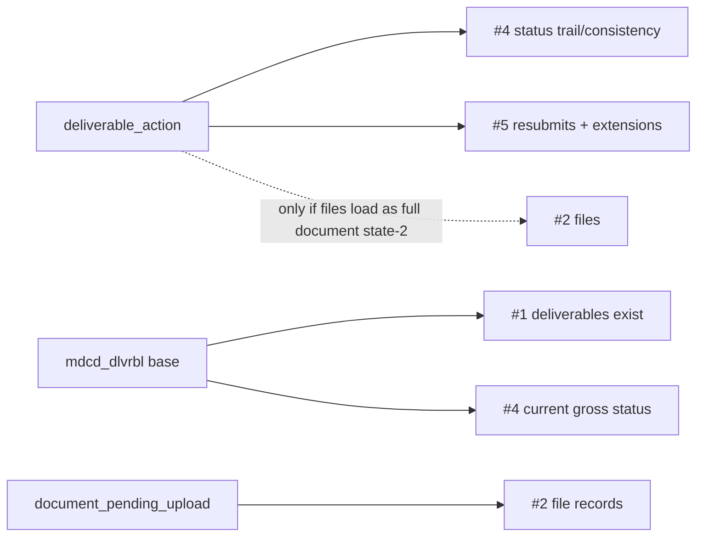

# Alignment: David's CMS deliverable priorities vs the migration (deliverable_action-centered)

**Status**: Analysis + proposed decisions (docs only; no loader/schema change)
**Date**: 2026-07-21
**Reconciles**: `reports/narrative/sme_signoff_2026-07-20.md` (new §11),
`reports/narrative/pending_approved_decisions.md` (D7 re-open; new D11/D12/D13),
`docs/specs/pmda-history-tables-derivation-spec.md`,
`docs/specs/comment-deliverable-resourcing-spec.md`,
`docs/specs/document-migration.md`

> **Origin**: David (SME) was asked how to fill the DEMOS `deliverable_action`
> table from the PMDA deliverable history tables. His reply gave a strict
> priority order for what CMS/SDG needs from the deliverable migration. This
> spec grades the migration against that order.

---

## 1. David's priority ledger (verbatim)

> IF I were SDG, here's what I hope, in priority order:
>
> 1. Deliverables from PMDA exist in DEMOS
> 2. Files Submitted in PMDA exist in DEMOS
> 3. Deliverable determination in DEMOS matches what it was in PMDA.
> 4. Gross Status (is submitted, not submitted, reviewed, not reviewed,
>    approved/accepted/recieved) is accurate in DEMOS
> 5. All the comments, Extensions, and Resubmit Requests are represented some how.
>
> There's a big drop off after 1-4 in terms of priority.

---

## 2. Priority-to-state alignment

| # | Priority | DEMOS target | State on `main` | Alignment |
|---|---|---|---|---|
| 1 | Deliverables exist | `deliverable` | **BUILT** (`sql/20_app/40_deliverable.sql`); `deliverable_type` + `deliverable_status` crosswalks authored. Non-gating hold-backs: non-Approved/held parent, soft-deleted, code-0 (N/A), unresolved owner, empty name, no due date. **`mdcd_dlvrbl_paper` (paper deliverables) is not loaded** - only its comments are read. | STRONG, coverage caveats |
| 2 | Files Submitted exist | `document` / `document_pending_upload` | **DEFERRED** (`sql/99_parity/30_scope_coverage.sql`: `document` DEFERRED). The `s3_path` wall applies only to full `document`; `document_pending_upload` needs no `s3_path` and is reachable now (see §4). | WEAK today, but unblockable |
| 3 | Determination matches | `deliverable.status_id` (terminal values) | **BUILT** (David 2026-07-21: determination = review outcome Accepted/Approved/Received and Filed). These are three seeded `deliverable_status` values, mapped by `crosswalk_deliverable_status` from `mdcd_dlvrbl_crnt_stus_cd` (codes 6/10 -> Accepted, 13 -> Approved, 12 -> Received and Filed). It is the terminal subset of #4. | STRONG |
| 4 | Gross status accurate | `deliverable.status_id` (+ `due_date_type_id`, `expected_to_be_submitted`) | **BUILT** - `crosswalk_deliverable_status` maps all 17 legacy codes -> 8 DEMOS statuses, sourced from `mdcd_dlvrbl_crnt_stus_cd`. | STRONG |
| 5 | Comments, Extensions, Resubmit Requests "represented some how" | `private/public_comment`, `deliverable_extension`, `deliverable_action` | **PARTIAL** - comments BUILT (`sql/20_app/50_comment.sql`); `crosswalk_comment_origin` values confirmed (ledger §5) but the SQL not yet authored. Extensions NOT built (proposed CSVs). Resubmit requests live only inside the deferred `deliverable_action` backfill. | PARTIAL (acceptable per David's low weighting) |

---

## 3. `deliverable_action` - the table David asked about

`deliverable_action` is the DEMOS append-only **workflow event log** (one row per
`old_status -> new_status` transition, by an actor, at an instant). It is
**DEFERRED** today (`sql/99_parity/30_scope_coverage.sql`). The approved plan
(`docs/specs/pmda-history-tables-derivation-spec.md`, D7) backfills it from the
PMDA history tables `mdcd_dlvrbl_stus_hstry` (41,018 live events, 9,370
deliverables, avg 4.38 transitions) + `mdcd_dlvrbl_hstry` (revision snapshots for
the NOT NULL due dates and note text). D7 was decided FULL (Zoe, 07/17) and
**switched to MINIMAL on 2026-07-21** (see §4.1): a genesis + current-status
trail per deliverable. The FULL fork's **D8** dependency (SME crosswalk for the
PMDA status codes with no direct DEMOS status: `Work in Progress`, `Overridden`,
`Overridden/Accepted`, `Overridden/Request Resubmission`,
`Pending Due Date Change`, `Open-ended`) drops off the critical path under
MINIMAL.

Which of David's priorities `deliverable_action` actually serves:

- **#4**: the *current* gross status is already on `deliverable.status_id` (BUILT).
  `deliverable_action` adds the *trail*; its gating rule is that each loaded
  deliverable's latest reconstructed action `new_status` equals
  `deliverable.status_id`.
- **#5**: resubmit requests (`Requested Resubmission`) and extension actions
  (`Requested/Approved/Denied/Withdrew Extension Request`) are action types in
  the log.
- **#2**: only relevant when a state-submitted file loads as a full `document`
  (state 2), whose `deliverable_submission_action_id` references the submitting
  `deliverable_action`. Metadata-only file records via `document_pending_upload`
  carry no submission-action link, so they need no `deliverable_action`.

---

## 4. Findings

### 4.1 Decision: MINIMAL backfill (was FULL) - aligned to David's ranking

`deliverable_action` primarily serves David's **lowest** band (#5) plus the #4
*trail*. Because a read-only snapshot is an acceptable representation for
extensions and resubmit requests (D12), the ~41k-row FULL backfill - and most of
the D8 crosswalk-authoring burden and self-transition disambiguation - exceeds
what David's priorities require.

**Decision (2026-07-21): switch the `deliverable_action` backfill to MINIMAL** -
one seeded genesis `Created Deliverable Slot` + one current-status action per
loaded deliverable. This supersedes the earlier D7=FULL (Zoe, 07/17). MINIMAL:

- satisfies the gating consistency rule (latest action `new_status` =
  `deliverable.status_id`), supporting #4's trail;
- gives every deliverable a non-empty action log (the DEMOS UI/resolver genesis
  assumption);
- sidesteps most D8 unmapped-code work (only the current status must map, and it
  already does via `crosswalk_deliverable_status`), so the FULL fork's
  self-transition disambiguation and the six unmapped PMDA status codes are no
  longer on the critical path.

The richer per-transition history (resubmits, extension rounds, due-date changes)
rides the #5 snapshot instead (D12). Recorded as the D7 re-open resolution.

### 4.2 Files (#2) are reachable now, decoupled from s3_path and the backfill

The `s3_path` blocker recorded in the ledger (§4.2) applies to full `document`
only. `document_pending_upload` (DEMOS model, "upload in progress") has **no
`s3_path` column**; its NOT NULLs are `owner_user_id` (rule already decided - D4:
Primary Project Officer, DDME for M&E) and `application_id` (resolvable
deliverable -> demonstration -> application). So file *records* can exist in
DEMOS today via `document_pending_upload`, with no dependency on the DEMOS
`s3_path` decision and no dependency on `deliverable_action`. This is the
priority-aligned path to satisfy David's #2 before the real blob/S3 move. See
D11.

### 4.3 Corrected DEMOS-repo facts (re-checked 2026-07-21)

A fresh read of `server/` after the recent pull:

- **`demonstration.chip_id` is still NOT NULL** with `@default(dbgenerated())`
  (`server/src/model/demonstration/demonstration.prisma`). No relaxation
  migration has landed (latest relevant: `20260623222056_add_migrated_user_features`,
  users-only). T0.1 remains a genuine load-abort, still guarded by Preflight P0.8.
- **`is_migrated_from_pmda` is still only on `users`** - not on `demonstration`,
  `amendment`, `application`, `deliverable`, or `document`. The
  `checkPhaseCompletionRules`/date-path skips (4B.1-4B.3) have not shipped.
- **`document.s3_path` is still NOT NULL**; `document_pending_upload` remains the
  only s3_path-free document variant.
- Recent DEMOS commits (`DEMOS-2445-basic-demo-adding`,
  `DEMOS-2319-migrated-user-path`, `2329/2330` no-submitted-state-files) refine
  submission/finalization behavior, not the migrated-load relaxations.

---

## 5. Resolved: "deliverable determination" (#3) = review outcome

David (2026-07-21): *"SDG uses the term 'Determination' to refer to the outcome
of a deliverable review. Accepted, Approved, or Received and Filed."*

**Disposition: BUILT.** The three outcomes are seeded DEMOS `deliverable_status`
values already mapped by `crosswalk_deliverable_status` from
`mdcd_dlvrbl_crnt_stus_cd` (D1):

| Determination | PMDA code(s) | DEMOS `deliverable_status` |
|---|---|---|
| Accepted | `6`, `10 Overridden / Accepted` | `Accepted` (terminal) |
| Approved | `13` | `Approved` (terminal) |
| Received and Filed | `12 Received` | `Received and Filed` (terminal) |

Determination is the **terminal subset of gross status (#4)**, carried by
`deliverable.status_id` on every loaded deliverable, so #3 and #4 are served by
the same built mechanism. The former candidates (deliverable type,
`cnfrmtn_stus`, BN-only `acptnc_stus`, due-date-change `dtrmntn`) are not what
David means. Recorded as **D13 (resolved)**.

**MINIMAL loader note:** a terminal-determination status is not reachable in one
hop from genesis (the seeded config only allows `Under CMS Review -> {Accepted,
Approved, Received and Filed}`), so the MINIMAL `deliverable_action` trail must
synthesize a short **legal** chain to the terminal status (see D7/§4.1 and D13).

---

## 6. TODO list

1. **#3 definition** - RESOLVED (David 2026-07-21): determination = review
   outcome (Accepted/Approved/Received and Filed) -> **BUILT** via
   `deliverable.status_id` (D13). No further work beyond the MINIMAL-loader legal
   chain to terminal statuses (TODO 2).
2. **D7 fidelity** - DECIDED **MINIMAL** (2026-07-21), superseding FULL. Build
   the genesis + current-status trail per loaded deliverable; drop the FULL
   self-transition disambiguation and the D8 unmapped-code crosswalk from the
   critical path (they move to the #5 snapshot, D12).
3. **#2 files** - scope a `document_pending_upload` metadata-only loader
   (owner = D4 rule, `application_id` resolvable), independent of `s3_path` and
   `deliverable_action` (D11).
4. **#5 snapshot** - scope the extensions + resubmit-requests read-only snapshot
   (extend `scripts/sme_review_exports.py`, mirroring the comments snapshot) (D12).
5. **#1 paper deliverables** - confirm `mdcd_dlvrbl_paper` disposition (currently
   only its comments load).
6. **Cross-repo blockers (still live)** - track `demonstration.chip_id`
   nullability + `is_migrated_from_pmda` beyond `users` (T0.1 / 4B.1); no new
   DEMOS relaxation has landed.
7. **D8 crosswalk** - with MINIMAL chosen, `crosswalk_deliverable_action` is no
   longer blocking: only the current status maps (already handled by
   `crosswalk_deliverable_status`). Keep D8 open only if/when FULL detail is
   later pulled from the #5 snapshot into live actions.

---

## 7. Verification

- `cd docs && make verify` + `python docs/tools/verify_doc_facts.py` on the
  new/edited docs.
- Docs-only: no SQL, loader, schema, or test changes.
