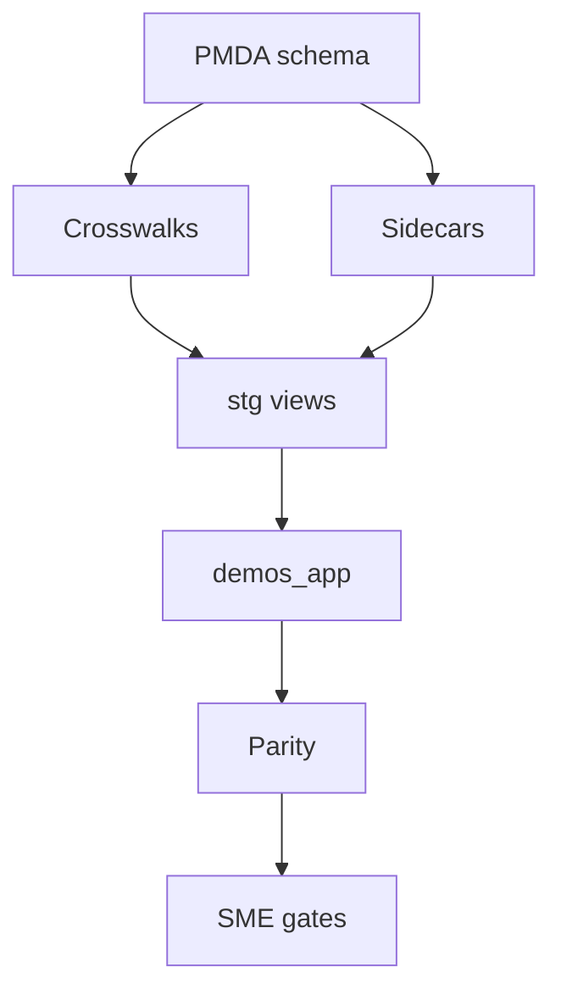

# PMDA Cross-Cutting Derivation Spec

**Status**: Approved (with corrections from codebase review)  
**Date**: 2026-06-18  
**Source Spec**: `~/.factory/specs/2026-06-18-pmda-cross-cutting-derivation-spec.md`

---

## Goal

Implement cross-cutting PMDA source derivations for DEMOS migration columns, using the `8bf725d` role-to-`person_type_id` pattern as the model: explicit crosswalk/sidecar data, staging derivation views, app loaders, and fail-closed parity checks.

## Data-Flow Design



Legend: `PMDA schema` = `reports/schema_snapshot` / loaded `mysql_raw`; `Crosswalks` = reviewed source-to-target domains; `Sidecars` = SME-provided IDs or overrides; `stg views` = deterministic derivation layer.

---

## Locked Decisions (Validated Against Codebase)

- **Project IDs**: Preserve valid `mdcd_demo_num → demonstration.medicaid_id`; `mdcd_scndry_demo_num → demonstration.chip_id` when valid. Missing target-required IDs block until supplied via validated sidecar keyed by `(source_table, legacy_id, target_column)`.
- **Signature Levels** (corrected 2026-06-24 against pinned Prisma DDL `20260602115947_check_signature_level`): `demonstration_signature_level_check` forces `signature_level_id` NOT NULL AND `= 'OA'`, so the demonstration loader sets the constant `'OA'` and the per-application PMDA code (incl. `OGD`) is **not** carried at the demonstration grain — the "preserve `OGD` / CHECK widening is an external blocker" position is **superseded** for `demonstration`. Signature-level derivation re-scopes to **amendment / extension**, whose CHECKs allow `signature_level_id` NULL OR `IN ('OA','OCD')`; crosswalk the PMDA code to `{OA, OCD}` and leave NULL when unmappable. See `reports/narrative/notes.md` (2026-06-24 pmda-scope).
- **Demo Status Code 1 (`Pending`)**: Remains blocked until SME review. Current proposal maps to `Pre-Submission` (confidence=medium) but SMEs must confirm vs `Under Review`.
- **Phase/Date Model**: Materialize full `application_date` and `application_phase`; derive `current_phase_id` from phase dates with status-based fallback and parity logging.
- **Soft Deletes**: Migrate in-scope business rows with `dltd_ind=1` using target lifecycle states (e.g., deliverable → `Deleted`). Drop technical tables (`*_hstry`, `*_pendg_*`, `bdgt_ntrlty_*`, `sys_parm`).
- **Owner/Author FKs**: Resolve from source `users`; block unresolved required owners.
- **Contact Migration**: **Not implemented on current `main`** — only filter views (`16_filter_cntct.sql`) and proposed crosswalk exist. New workstream needed for contact-only `person`, `person_state`, `demonstration_role_assignment`.
- **Program-Detail Tags**: Expand beyond current 10-table mapping to **all mappable non-backup base/pending `*_pgm_dtl` tables** (see Table 1 below).
- **BN Deliverable Routing**: `mdcd_dlvrbl.bdgt_ntrlty_ind` authoritative; `bdgt_ntrlty_fil_ind` creates workbook rows. Semi-annual BN (type 5/6 + `bdgt_ntrlty_ind=1`) has no DEMOS type — **blocked on SME decision**.
- **Document Routing**: Source family → explicit flags → type-code crosswalk (see Table 2).
- **`mdcd_demo_type_cd`**: Scoped metadata only; canonical demo tags from program-detail rows.
- **Reference Materials**: `rfrnc_matl` → `reference` + `reference_tag_assignment` where crosswalkable.

---

## Table 1: Program-Detail Tables — Current vs Required Coverage

| Source Table | Rows (table_stats) | In `pgm_dtl_tag_mapping.csv`? | Priority |
|--------------|-------------------|-------------------------------|----------|
| `mdcd_hcbs_pgm_dtl` | 23 | ✅ | — |
| `mdcd_fmly_plng_pgm_dtl` | 37 | ✅ | — |
| `mdcd_dntl_pgm_dtl` | 19 | ✅ | — |
| `mdcd_hiv_pgm_dtl` | >0 | ✅ | — |
| `mdcd_sud_pgm_dtl` | >0 | ✅ | — |
| `mdcd_smi_pgm_dtl` | >0 | ✅ | — |
| `mdcd_ltss_pgm_dtl` | >0 | ✅ | — |
| `mdcd_vsn_pgm_dtl` | >0 | ✅ | — |
| `mdcd_mc_pgm_dtl` | >0 | ✅ | — |
| `mdcd_prm_astnc_pgm_dtl` | >0 | ✅ | — |
| `mdcd_dsrip_pgm_dtl` | 50 | ❌ | **HIGH** |
| `mdcd_elgblty_and_cvrg_pgm_dtl` | 64 | ❌ | **HIGH** |
| `mdcd_bene_enggmt_pgm_dtl` | 34 | ❌ | **HIGH** |
| `mdcd_cmnty_enggmt_pgm_dtl` | 24 | ❌ | **HIGH** |
| `mdcd_emer_wvr_authrty_pgm_dtl` | 36 | ❌ | **HIGH** |
| `mdcd_chip_pgm_dtl` | 15 | ❌ | **HIGH** |
| `mdcd_bhvrl_hlth_pgm_dtl` | 25 | ❌ | MEDIUM |
| `mdcd_bnfts_pgm_dtl` | 20 | ❌ | MEDIUM |
| `mdcd_ffcy_pgm_dtl` | 26 | ❌ | MEDIUM |
| `mdcd_covid_pgm_dtl` | 25 | ❌ | MEDIUM |
| `mdcd_ann_lmts_pgm_dtl` | 2 | ❌ | LOW |
| `mdcd_apndx_k_pgm_dtl` | 16 | ❌ | LOW |
| ...and 20+ more base tables | | ❌ | LOW |

**Action**: Expand `reports/pgm_dtl_tag_mapping.csv` to all mappable base + pending tables. Unknown stems → SME review report; block if in-scope rows would drop.

---

## Table 2: Document Source Families

| Family | Source Table | Type Column | BN Flag Column | Notes |
|--------|--------------|-------------|----------------|-------|
| Deliverable files | `mdcd_dlvrbl_fil_doc` | `fil_doc_cd` | `bdgt_ntrlty_fil_ind` | Workbook rows from BN flag |
| Application docs | `mdcd_demo_aplctn_doc` | `mdcd_demo_aplctn_doc_type_cd` | — | |
| Template files | `tmplt_fil_doc` | `tmplt_fil_doc_type_cd` | — | |
| Reference materials | `rfrnc_matl` | `rfrnc_matl_doc_type_cd` | — | Also carries `mdcd_demo_type_cd`, `plcy_area_type_cd` |

---

## Table 3: Phase/Date Column Mapping

| Source Column (`mdcd_demo`) | Target `application_date.date_type` | Phase Inference |
|-----------------------------|-------------------------------------|-----------------|
| `rcvd_dt` | `ApplicationReceived` | Phase 1 start |
| `submsn_dt` | `ApplicationSubmitted` | Phase 1 complete |
| `phase_2_rcvd_dt` | `Phase2Received` | Phase 2 start |
| `phase_2_state_aplctn_deemd_cmpltn_dt` | `Phase2DeemedComplete` | Phase 2 complete |
| `aprvl_dt` | `Approved` | Phase 3 (Approval) |
| `impltn_dt` | `Implemented` | Phase 4 (Implementation) |

Derive `application_phase` rows from highest completed phase; `current_phase_id` = latest started phase. Fallback to status-based inference (`Approved`→`Approval Summary`, `Pre-Submission`→`Concept`, `Under Review`/`On-hold`→`Review`) only when dates sparse; log parity warnings.

---

## Table 4: Soft Delete Handling by Table Category

| Category | Tables | `dltd_ind=1` Handling |
|----------|--------|----------------------|
| Core business | `mdcd_demo`, `mdcd_dlvrbl`, `mdcd_demo_aplctn`, `mdcd_demo_amndmt`, `mdcd_demo_rnwl`, `mdcd_pendg_demo` | Migrate with target lifecycle state (e.g., deliverable `status_id='Deleted'`) |
| Backup/history | `*_hstry` | Drop — technical only |
| Pending mirrors | `mdcd_pendg_*` | Drop — superseded by base |
| Budget neutrality | `bdgt_ntrlty_*` | Drop — derived at load |
| System params | `sys_parm`, `sys_parm_rfrnc` | Drop |

---

## Implementation Plan (Corrected)

### 1. Project ID Sidecar & Checks
- Add validated SME sidecar for missing `medicaid_id` / `chip_id` keyed by `(source_table, legacy_id, target_column)`.
- Derive in demonstration staging layer.
- Fail closed: missing, malformed, duplicate, or orphan sidecar rows → actionable parity error.

### 2. Approval-Time Fields
- **DONE (2026-06-24):** Crosswalk `mdcd_chip_div_cd → sdg_division_id` via `mysql_raw.crosswalk_sdg_division`, carried through `stg.demonstration_resolved.sdg_division_cd` and populated in `20_app/30_demonstration.sql`. Approved demos missing `sdg_division_id` / `effective_date` / `expiration_date` are held back (non-fatal) and logged to `migration._parity_approved_demo_held` + parity check 13.
- `signature_level_id` on `demonstration` is the constant `'OA'` (CHECK-forced); per-application signature derivation re-scopes to amendment/extension (see corrected Locked Decision above).
- Parity checks: Approved-completeness hold-back is parity check 13 (non-gating log); completeness check 8 excludes the deliberate hold-backs.

### 3. Status & Phase Derivations
- Keep demo status code `1` unmapped until SME confirmation.
- Build phase-date → `date_type`/`phase` mapping (Table 3).
- Insert `application_date` rows for non-null mapped dates.
- Insert `application_phase` rows; derive `current_phase_id` with status fallback + parity logging.

### 4. Program-Detail Tags
- Expand `reports/pgm_dtl_tag_mapping.csv` to all mappable base + pending `*_pgm_dtl` (Table 1).
- Generate `demonstration_type_tag_assignment` from table stem + `from_dt`/`to_dt`.
- Unknown stems → SME review report; block if in-scope rows would drop.

### 5. Users, Contacts, States, Roles
- Keep `role_cd → person_type_id` (existing `42_role_person_type.sql`, 9 rows).
- Add contact-only person staging from wide contact tables (`mdcd_demo_cntct`, `mdcd_pendg_demo_cntct`), keyed by normalized email where no `users` row exists.
- Populate `person_state`, `system_role_assignment`, `demonstration_role_assignment`, primary assignment.
- Column-specific derivation for ambiguous roles (`CMS Technical Director`→`Policy TD`, `Monitoring Lead`/`Financial Lead`→`M&E TD`/`Project Officer`); block role-code-only ambiguity.

### 6. Deliverables, Documents, Comments, BN
- Resolve deliverable status tuples: `status_id`, `due_date_type_id`, `expected_to_be_submitted`, extension/action rows.
- Route deliverable type via `(mdcd_dlvrbl_type_cd, bdgt_ntrlty_ind)` matrix; block semi-annual BN pending SME.
- Route documents by source family (Table 2), flags, type crosswalk.
- Route comments: `cmt_orgn_cd` state-origin → `public_comment`; CMS/internal/missing → `private_comment`; fallback + parity warnings.

### 7. Reference Materials
- Map `rfrnc_matl` → `reference`.
- Derive `reference_tag_assignment` from `mdcd_demo_type_cd` + `plcy_area_type_cd` where target tags exist.
- Block unresolved document-type/tag combos unless SMEs mark out of scope.

### 8. Column Map & Validation
- Update `reports/source_target_columns.csv` for every new `derive`, `crosswalk`, `sidecar`, `tag_pivot`, `comment_route` rule.
- Add fail-closed parity views for blocked conditions and row accounting.
- Run repo validators: Python tests, SQL idempotency tests, docs/schema verification, Makefile checks.

---

## Acceptance Criteria

- Every target NOT NULL/FK field from these derivations is populated deterministically or fails with actionable parity row.
- No soft-deleted in-scope business row lost solely due to `dltd_ind`.
- Contact-only persons and role assignments represented on current `main`.
- Program-detail coverage expands beyond 10-row manifest to all mappable in-scope tables (Table 1).
- All blockers explicit: demo status code `1`, missing SME project IDs, `OGD` CHECK widening (external), unknown program stems, unresolved required owners, semi-annual BN rows, unresolved document/reference mappings.

---

## Blocker Summary (External Dependencies)

| Blocker | Owner | Status |
|---------|-------|--------|
| DEMOS CHECK widening for `OGD`/`DD` signature levels | DEMOS team | **Required before OGD rows load** |
| SME sidecar values for missing Medicaid/CHIP IDs | State SMEs | **Required before demonstration load** |
| Demo status code `1` (`Pending`) mapping | CMS/State SMEs | **Required before demo load** |
| Semi-annual BN deliverable type decision | SMEs | **Required if source rows exist** |
| Unknown program-detail stem mappings | SMEs | **Required before tag derivation** |

---

## Document → Deliverable Linkage Routing (3-State)

DEMOS migration `20260623125420_no_deliverable_submitted_cms_files` (mirrored into the pinned Prisma DDL `state/prisma_ddl/<sha>.sql`, pinned via `reports/prisma_ddl.sha256`) finalizes a three-way routing rule for every migrated `demos_app.document` row. Its intent is that a file **attached by CMS** to a deliverable can never simultaneously be recorded as a **state submission**: the migration first runs `UPDATE demos_app.document SET deliverable_submission_action_id = NULL WHERE deliverable_is_cms_attached_file = TRUE`, then adds the guard CHECK below. (The constraint name reorders the words: migration `20260623125420_no_deliverable_submitted_cms_files`, constraint `no_submitted_deliverable_cms_files`.)

The relevant `document` columns (all nullable, from `CREATE TABLE "document"`) are `deliverable_id` (UUID), `deliverable_type_id` (TEXT), `deliverable_is_cms_attached_file` (BOOLEAN), `deliverable_submission_action_id` (UUID), and `deliverable_submission_action_type_id` (TEXT). Two CHECK constraints jointly fix the legal combinations:

- `check_deliverable_null_states` ties the deliverable columns together as all-absent or linked:

  ```sql
  CHECK (
      (deliverable_id IS NULL
          AND deliverable_type_id IS NULL
          AND deliverable_is_cms_attached_file IS NULL
          AND deliverable_submission_action_id IS NULL
          AND deliverable_submission_action_type_id IS NULL)
      OR
      (deliverable_id IS NOT NULL
          AND deliverable_type_id IS NOT NULL
          AND deliverable_is_cms_attached_file IS NOT NULL)
  );
  ```

- `no_submitted_deliverable_cms_files` (new in `20260623125420`) forbids a CMS-attached file from carrying a submission action:

  ```sql
  CHECK (
      NOT (deliverable_is_cms_attached_file = true AND deliverable_submission_action_id IS NOT NULL)
  );
  ```

Together these route every `document` row into exactly one of three states:

1. **Non-deliverable document**: not linked to any deliverable (`deliverable_id IS NULL`). `check_deliverable_null_states` then forces `deliverable_is_cms_attached_file IS NULL` and `deliverable_submission_action_id IS NULL` (the flag is NULL, not `false`).
2. **State-submitted deliverable document**: linked to a deliverable and submitted by a state user. `deliverable_is_cms_attached_file = false`; `deliverable_submission_action_id` points at the submitting `deliverable_action` row (see the deliverable_action state-machine section below). Permitted by `no_submitted_deliverable_cms_files` because the CMS-attached flag is false.
3. **CMS-attached deliverable file**: linked to a deliverable but attached by CMS rather than submitted by the state. `deliverable_is_cms_attached_file = true`; `no_submitted_deliverable_cms_files` then requires `deliverable_submission_action_id IS NULL`.

### Table 5: Document Deliverable-Linkage States

| State | `deliverable_id` | `deliverable_is_cms_attached_file` | `deliverable_submission_action_id` |
|-------|------------------|------------------------------------|-------------------------------------|
| 1. Non-deliverable document | `NULL` | `NULL` (¹) | `NULL` |
| 2. State-submitted deliverable document | `NOT NULL` | `false` | `NOT NULL` (→ submitting `deliverable_action`) |
| 3. CMS-attached deliverable file | `NOT NULL` | `true` | `NULL` (forced by the CHECK) |

(¹) Per `check_deliverable_null_states`, a non-deliverable document carries `deliverable_is_cms_attached_file = NULL`, not `false`; the flag is meaningful only when `deliverable_id IS NOT NULL`.

Precision notes:

- `deliverable_submission_action_id` is column-level nullable even in state 2: the CHECKs also permit a deliverable-linked, non-CMS document with no submission action (e.g. a `General File` on a not-yet-submitted deliverable). The `NOT NULL` entry above describes the routing target when the document *is* the submitted artifact, not a NOT NULL column.
- `deliverable_submission_action_type_id` travels with `deliverable_submission_action_id` via the composite FK `document(deliverable_submission_action_id, deliverable_submission_action_type_id) → deliverable_action(id, action_type_id)`, and is independently FK-limited to the single seeded submission action type (see below). It is NULL in states 1 and 3.

**Status: spec contract only; document loader deferred.** The source signal that distinguishes state 2 from state 3 (the `document_type` / attachment-origin fan-in across the legacy upload tables) is still SME-blocked (`reports/crosswalks/proposed/_review.md` P4; `reports/narrative/notes.md` 2026-06-24 WP4). The routing rule is recorded here now so the loader can be built deterministically once the fan-in is resolved; until then no `demos_app.document` deliverable loader is authored.

---

## deliverable_action State-Machine Derivation

A future `deliverable_action` loader synthesizes the per-deliverable workflow events that DEMOS would otherwise create at runtime. **The pinned DDL does not seed any `deliverable_action` rows** (every `demos_app.deliverable_action` statement is an `ALTER TABLE … ADD CONSTRAINT`, never an `INSERT`); it seeds only the supporting domains, so the loader must derive the event rows from the legacy deliverable status/history source.

What the DDL **does** seed:

- `deliverable_action_type`: the action-name domain (`id` plus four boolean flags), 14 rows reproduced verbatim in Table 6.
- `deliverable_action_configuration`: the legal state machine, as `(action_type_id, old_status_id, new_status_id)` triples.
- `deliverable_submission_action_type_limit`: seeded with exactly one row, `('Submitted Deliverable')`.
- `deliverable_status` domain (8 ids): `'Upcoming'`, `'Past Due'`, `'Submitted'`, `'Under CMS Review'`, `'Accepted'`, `'Approved'`, `'Received and Filed'`, `'Deleted'`.

### Table 6: Seeded `deliverable_action_type` Rows (verbatim)

| `id` | `due_date_change_allowed` | `should_have_note` | `should_have_user_id` | `extension_id_optional` |
|------|---------------------------|--------------------|-----------------------|-------------------------|
| `Created Deliverable Slot` | FALSE | FALSE | TRUE | TRUE |
| `Marked as Past Due` | FALSE | FALSE | FALSE | TRUE |
| `Requested Extension` | FALSE | TRUE | TRUE | FALSE |
| `Approved Extension Request` | TRUE | FALSE | TRUE | FALSE |
| `Denied Extension Request` | FALSE | TRUE | TRUE | FALSE |
| `Withdrew Extension Request` | FALSE | FALSE | TRUE | FALSE |
| `Manually Changed Due Date` | TRUE | TRUE | TRUE | TRUE |
| `Requested Resubmission` | TRUE | TRUE | TRUE | TRUE |
| `Submitted Deliverable` | FALSE | FALSE | TRUE | TRUE |
| `Started Review` | FALSE | FALSE | TRUE | TRUE |
| `Accepted Deliverable` | FALSE | FALSE | TRUE | TRUE |
| `Approved Deliverable` | FALSE | FALSE | TRUE | TRUE |
| `Received and Filed Deliverable` | FALSE | FALSE | TRUE | TRUE |
| `Deleted Deliverable` | FALSE | FALSE | TRUE | TRUE |

**State machine.** `deliverable_action_configuration` enumerates the allowed `(action_type_id, old_status_id → new_status_id)` transitions over the `deliverable_status` domain; every derived `deliverable_action` row must match one seeded triple. The submission action's transitions are:

```sql
('Submitted Deliverable', 'Upcoming', 'Submitted'),
('Submitted Deliverable', 'Past Due', 'Submitted'),
('Submitted Deliverable', 'Submitted', 'Submitted'),
('Submitted Deliverable', 'Under CMS Review', 'Submitted'),
```

**Submission-linkage contract.** `document.deliverable_submission_action_id` references the specific submission `deliverable_action` for a deliverable through the composite FK `document(deliverable_submission_action_id, deliverable_submission_action_type_id) → deliverable_action(id, action_type_id)`. The accompanying `document.deliverable_submission_action_type_id` is FK-constrained to `deliverable_submission_action_type_limit`, which the DDL seeds with the single value `'Submitted Deliverable'`. Therefore the referenced action's `action_type_id` must be exactly `'Submitted Deliverable'`; no other action type can be a document's submission action.

**Per-row integrity a loader must satisfy** (verbatim CHECK constraints on `demos_app.deliverable_action`):

- `block_unpermitted_due_date_changes`: `NOT (due_date_change_allowed = FALSE AND old_due_date != new_due_date)`
- `check_non_empty_note`: `(note IS NULL OR trim(note) != '')`
- `require_extension_id_for_extension_actions`: `(extension_id_optional = TRUE) OR (extension_id_optional = FALSE AND active_extension_id IS NOT NULL)`
- `require_notes_for_user_actions`: `(should_have_note = FALSE AND note IS NULL) OR (should_have_note = TRUE AND note IS NOT NULL)`
- `require_user_id_for_user_actions`: `(should_have_user_id = FALSE AND user_id IS NULL) OR (should_have_user_id = TRUE AND user_id IS NOT NULL)`

The four boolean flags on each row are not free: they must equal the seeded `deliverable_action_type` row for that `action_type_id` (composite FK `deliverable_action(action_type_id, due_date_change_allowed, should_have_note, should_have_user_id, extension_id_optional) → deliverable_action_type(...)`), and `(action_type_id, old_status_id, new_status_id)` must exist in `deliverable_action_configuration`. `deliverable_id → deliverable`, `user_id → users`, and `active_extension_id → deliverable_extension` complete the FK shape.

**Status: derivation deferred.** The `deliverable_action` loader is gated on the same SME fan-in decision as the document loader (which legacy workflow / status-history rows map to which seeded action type, and how state-submission vs CMS-attachment is read from the source). Until that lands, neither `deliverable_action` nor the `document.deliverable_submission_action_id` submission linkage is built; both remain spec contracts, consistent with the deferred deliverable workflow recorded in `reports/narrative/notes.md` (2026-06-24 WP4).
