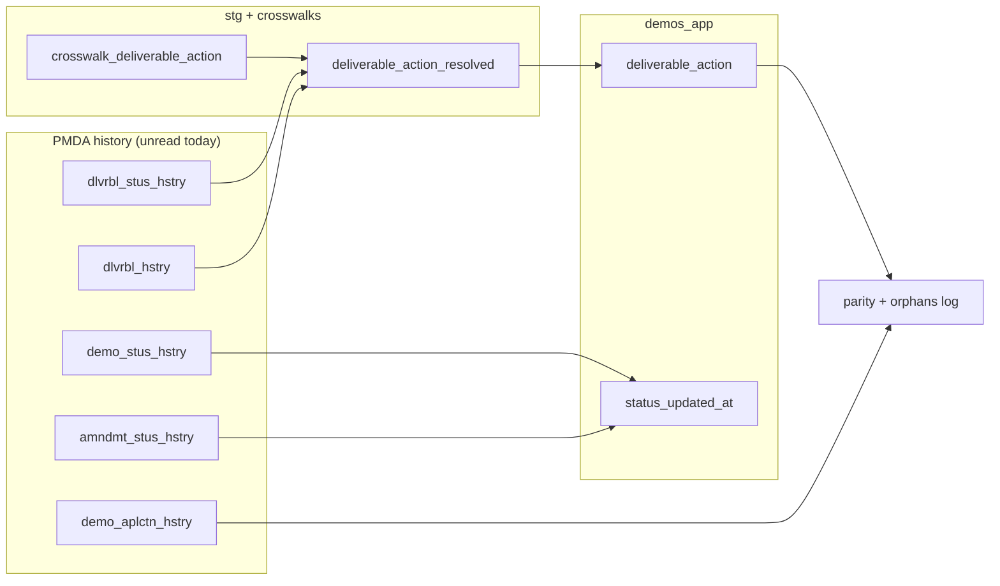

# Spec: Utilizing PMDA history tables to enhance the DEMOS migration

**Status**: Approved (plan)
**Date**: 2026-07-17
**Source Spec**: `~/.factory/specs/2026-07-17-utilizing-pmda-history-tables-to-enhance-the-demos-migration.md`

> **2026-07-20 SME reconciliation** (`reports/narrative/sme_signoff_2026-07-20.md`):
> Stephanie's "backfill vs one synthetic 'migrated from PMDA' action; easiest
> wins" is **resolved as a history backfill** (not a synthetic action type: a
> synthetic action/transition has no legal row in the seeded
> `deliverable_action_configuration` composite FK and would need a cross-repo
> DEMOS seed change, so it is neither easier nor legal).
>
> **2026-07-21 fidelity re-decision (supersedes FULL): MINIMAL.** David's CMS
> priority ranking (§11 of the ledger;
> `docs/specs/deliverable-action-cms-priority-alignment-spec.md`) places
> `deliverable_action` in his lowest band and accepts a read-only snapshot for
> extensions/resubmit requests (D12). The **MINIMAL legal trail** (one seeded
> genesis `Created Deliverable Slot` + one current-status action per loaded
> deliverable) is now the primary plan. It keeps Workstream 1's staging/loader
> skeleton but derives only the genesis + current-status rows, so the FULL
> per-transition crosswalk (D8 unmapped codes + self-transition disambiguation)
> is off the critical path. Workstreams 2 and 3 are unchanged.

---

## Goal

The PMDA source carries populated, per-revision transition-history tables that
the migration reads **nowhere today** (a repo-wide `grep hstry sql/**` returns
zero hits; every phase/date/status derivation reads only the point-in-time base
tables `mdcd_demo`, `mdcd_demo_aplctn`, `mdcd_demo_amndmt`, `mdcd_dlvrbl`). This
spec defines how to mine those history tables to:

1. **Build `deliverable_action`** -- the currently-unbuilt DEMOS workflow event
   log -- from the deliverable status-change history (the main effort).
2. **Replace synthetic `status_updated_at`** on `demonstration` / `amendment`
   with the real last status-change instant.
3. **Add a non-gating audit** comparing the point-in-time phase derivation
   against a history-derived reconstruction (no load change).

This is distinct from the `history_strategy.md` decision. That decision governs
the DEMOS `*_history` tables (revision shadows owned by DEMOS, filled
post-cutover by capture triggers). `deliverable_action` is **not** a `*_history`
table: it is a real, app-written workflow event log, and DEMOS capture triggers
can only record actions that happen *after* cutover. Without a backfill, every
migrated deliverable shows its current status with no trail explaining how it
got there.

## Empirical validation (LIVE PROD `cma_pro_11_1_000`, 2026-07-16/17; IMPL counts will differ)

Queried read-only via the `mysql-ducksplorer` skill (DuckDB -> MySQL, password
never printed):

| History table | Rows (live) | Shape | Key temporal signal |
|---|---|---|---|
| `mdcd_dlvrbl_stus_hstry` | 41,018 (all `dltd_ind=0`) | append-only event log | `creatd_dt` (100%), `creatd_user_id` (88.7%), status per row |
| `mdcd_dlvrbl_hstry` | 45,344 (45,033 live) | full-row snapshot / revision | `hstry_updtd_dt`, per-revision due dates + change-reason note text |
| `mdcd_demo_stus_hstry` | 276 | event log | `creatd_dt` + effective `mdcd_demo_stus_dt`; **no actor column** |
| `mdcd_demo_amndmt_stus_hstry` | 30 | event log | `creatd_dt` + `creatd_user_id` (actor); thin coverage |
| `mdcd_demo_aplctn_hstry` | 3,780 (3,705 live) | full-row snapshot / revision | `hstry_ts` + every `phase_*` milestone date per revision |

- `mdcd_dlvrbl_stus_hstry`: 9,370 distinct deliverables, avg **4.38**
  transitions each (min 1, max 86). Distinct status codes observed (PMDA
  `mdcd_dlvrbl_stus_rfrnc`, with live counts): `2 Work in Progress` 11,362 /
  `1 Upcoming` 6,926 / `3 Submitted` 6,298 / `6 Accepted` 4,345 / `5 Past Due`
  3,778 / `14 Under CMS Review` 3,067 / `12 Received` 2,492 /
  `16 Pending Due Date Change` 1,480 / `4 Requested Resubmission` 816 /
  `13 Approved` 320 / `15 Open-ended` 53 / `7 Overridden` 51 /
  `11 Overridden/Request Resubmission` 21 / `10 Overridden/Accepted` 9.
- Null-actor rows (~11.3%) are system-generated transitions (automated
  "Past Due" flips; system user id 99).
- History date ranges span the demonstrations we migrate
  (`mdcd_dlvrbl_stus_hstry`: 2016-10 .. 2026-07; `mdcd_demo_aplctn_hstry`:
  2021-08 .. 2026-07).

## Data-flow design

---

## Workstream 1 (branch): `deliverable_action` backfill

### Target contract (source of truth: `../demos/server/src/model/deliverableAction/deliverableAction.prisma`)

`deliverable_action` is an **append-only event log** (no `created_at`/
`updated_at`; time is the `action_timestamp`). Every row is one transition
`old_status_id -> new_status_id` by an actor at an instant. NOT NULL columns:
`id`, `action_timestamp`, `deliverable_id`, `action_type_id`, `old_status_id`,
`new_status_id`, `old_due_date`, `new_due_date`, and the 4 type booleans
(`due_date_change_allowed`, `should_have_note`, `should_have_user_id`,
`extension_id_optional`). Nullable: `note`, `active_extension_id`, `user_id`.

Composite FKs constrain every row to a **legal** action:

- `(action_type_id, old_status_id, new_status_id) -> deliverable_action_configuration`
  -- the transition must be in the seeded state machine.
- `(action_type_id, due_date_change_allowed, should_have_note,
  should_have_user_id, extension_id_optional) -> deliverable_action_type`
  -- the 4 booleans are not free; they must match the seeded action-type row.
- `(active_extension_id, deliverable_id) -> deliverable_extension(id, deliverableId)`.
- `user_id -> users(id)`.

CHECK constraints a loader must satisfy:
`block_unpermitted_due_date_changes` (`due_date_change_allowed=FALSE` =>
`old_due_date=new_due_date`), `check_non_empty_note`,
`require_extension_id_for_extension_actions`,
`require_notes_for_user_actions` (`should_have_note` <=> `note IS NOT NULL`),
`require_user_id_for_user_actions` (`should_have_user_id` <=> `user_id IS NOT NULL`).

### The seeded state machine (grounded in `20260312131759_init_baseline/migration.sql`)

Only 8 statuses exist: `Upcoming`, `Past Due`, `Submitted`, `Under CMS Review`,
`Accepted`, `Approved`, `Received and Filed`, `Deleted`. The 14 action types and
their `(due_date_change_allowed, should_have_note, should_have_user_id,
extension_id_optional)` flags:

| Action type | ddc | note | user | ext_opt |
|---|:--:|:--:|:--:|:--:|
| Created Deliverable Slot | F | F | T | T |
| Marked as Past Due | F | F | **F** | T |
| Requested Extension | F | T | T | F |
| Approved Extension Request | T | F | T | F |
| Denied Extension Request | F | T | T | F |
| Withdrew Extension Request | F | F | T | F |
| Manually Changed Due Date | T | T | T | T |
| Requested Resubmission | T | T | T | T |
| Submitted Deliverable | F | F | T | T |
| Started Review | F | F | T | T |
| Accepted Deliverable | F | F | T | T |
| Approved Deliverable | F | F | T | T |
| Received and Filed Deliverable | F | F | T | T |
| Deleted Deliverable | F | F | T | T |

Legal transitions (`deliverable_action_configuration`), abbreviated:
`Submitted Deliverable`: {Upcoming|Past Due|Submitted|Under CMS Review}->Submitted;
`Started Review`: Submitted->Under CMS Review; `Accepted`: Under CMS Review->Accepted;
`Approved`: Under CMS Review->Approved; `Received and Filed`: Under CMS Review->Received and Filed;
`Marked as Past Due`: Upcoming->Past Due; `Requested Resubmission`:
{Submitted|Under CMS Review}->Upcoming; `Deleted`: {Upcoming|Past Due}->Deleted;
and self-transitions (X->X) for `Created Deliverable Slot`, the four
extension actions, and `Manually Changed Due Date`.

### Two hard derivation facts

1. **`action_type` is NOT a pure function of `(old_status, new_status)`.**
   Self-transitions (X->X) are shared by `Created Deliverable Slot`, all four
   extension actions, and `Manually Changed Due Date`. A pure status log cannot
   disambiguate them. The crosswalk must use extra signal -- the PMDA status
   code semantics (e.g. `16 Pending Due Date Change`) and a detected due-date
   change in `mdcd_dlvrbl_hstry` -- and hold back unresolved self-transitions.
2. **Null-actor rows are coherent, not a defect.** PMDA's automated "Past Due"
   flips carry no `creatd_user_id`; they map to `Marked as Past Due`, the one
   action type whose `should_have_user_id=FALSE` *requires* `user_id IS NULL`.
   Conversely, a user-required action type with a null actor -- or a
   note-required type (`Requested Extension`, `Denied Extension Request`,
   `Manually Changed Due Date`, `Requested Resubmission`) with no change-reason
   text -- cannot satisfy its CHECK and is held back.

### Reconstruction algorithm (staging)

Per deliverable, order `mdcd_dlvrbl_stus_hstry` by `creatd_dt`; derive
`old_status` via `LAG` over the crosswalked status; `new_status` = current row's
crosswalked status; `action_timestamp` = `creatd_dt`; `user_id` =
`creatd_user_id` via `migration._id_map_users`; join `mdcd_dlvrbl_hstry` on the
nearest revision at/under `creatd_dt` for `old_due_date` / `new_due_date` (for
`due_date_change_allowed=FALSE` types, force `old=new`) and for the note text
(`mdcd_dlvrbl_due_dt_chg_rsn_cmt_txt` / `mdcd_dlvrbl_late_submsn_rsn_cmt_txt`).
`action_type` and the legality of each `(action_type, old, new)` triple come
from `crosswalk_deliverable_action`.

### SME fork (decision D7): Full vs Minimal fidelity -- DECIDED MINIMAL (2026-07-21)

- **Minimal (CHOSEN)**: one seeded `Created Deliverable Slot` genesis + one
  current-status action per deliverable. Trail non-empty, status explained,
  near-zero crosswalk risk. Chosen because David ranks `deliverable_action` in
  his lowest priority band and accepts a read-only snapshot for the
  per-transition resubmit/extension history (D12).
- ~~**Full**: one action row per legal transition (~41k source events).~~
  Superseded; retained only as a future option if per-transition detail is later
  promoted from the D12 snapshot into live actions.

Under MINIMAL the reconstruction reduces to two rows per deliverable: a genesis
`Created Deliverable Slot` (whose `old_status = new_status = 'Upcoming'` seed
start) and a single terminal action landing on the deliverable's current
`status_id` (via `crosswalk_deliverable_status`), so only the current status
must map -- the six unmapped PMDA status codes (D8) and self-transition
disambiguation no longer gate the build.

No DB constraint requires >=1 action per deliverable (verified against the
baseline DDL). Whether the DEMOS UI/GraphQL resolver assumes a genesis
`Created Deliverable Slot` remains a follow-up for DEMOS engineering; under
MINIMAL the genesis row is synthesized for every loaded deliverable regardless.

### Gating posture (decision from grill)

- **Gating**: for each loaded deliverable, the latest reconstructed action's
  `new_status` must equal `deliverable.status_id` (so DEMOS's post-cutover state
  machine continues correctly); plus FK/CHECK integrity.
- **Non-gating** (per-row log to `reports/orphans/`): coverage, and every held
  row (unmappable transition, unresolved actor for a user-required type, missing
  note for a note-required type, extension-typed action pending
  `deliverable_extension`).

### Ordering constraint

The backfill runs inside `build_app`, **before** the operator's
`refreshDbObjects.ts` installs the `log_changes_deliverable_action` capture
trigger. Backfilled rows therefore generate no `deliverable_action_history`
rows, consistent with the empty-history strategy.

### Files to add (Workstream 1)

- `sql/04_crosswalks/NN_deliverable_action.sql` -- `mysql_raw.crosswalk_deliverable_action`
  DDL (`prev_code`, `new_code`, disambiguator, `action_type_id`), empty until
  SME-authored; fail-closed `_check.sql` once any in-scope transition is
  unmapped. **Blocking SME sign-off.**
- `sql/05_id_maps/NN_mdcd_dlvrbl_stus_hstry.sql` + `sql/10_stg/NN_populate_*` --
  id map (minted UUID PK per source event).
- `sql/10_stg/NN_deliverable_action_resolved.sql` -- source-only resolver
  (algorithm above), guarded on its source tables.
- `sql/20_app/NN_deliverable_action.sql` -- loader (`ON CONFLICT (id) DO
  NOTHING`, scoped to loaded `deliverable`, sets the 4 booleans from
  `deliverable_action_type`); guarded inert until the resolver + crosswalk
  exist.
- `sql/99_parity/NN_deliverable_action_latest_matches_status.sql` (gating),
  `..._integrity.sql` (gating), `..._held.sql` + `..._coverage.sql` (non-gating).
- `migration/phases/parity.py` -- register the new checks.

### Files to change (Workstream 1)

- `sql/99_parity/30_scope_coverage.sql` -- add a `deliverable_action` row
  (`DEFERRED` until the loader lands, then `BUILT`/`PARTIAL`).
- `reports/source_target_columns.csv` -- add the `deliverable_action` column
  rules.
- `reports/inputs/proposed_table_map.yaml` -- update the `deliverable_action`
  note (was "net-new; PMDA stores status, not discrete actions").

---

## Workstream 2 (separate branch): real `status_updated_at`

Today `demonstration.status_updated_at = updated_at` and
`amendment.status_updated_at = created_at` (synthetic; not real status-change
instants). Replace with the latest real status-change instant:

- **Demonstration**: from `mdcd_demo_stus_hstry` (recorded `creatd_dt`; effective
  `mdcd_demo_stus_dt`). Caveat: no actor column, so no attribution -- only the
  timestamp improves. Anchor date-only values via `migration.eastern_day_*`
  (per decision D3).
- **Amendment**: from `mdcd_demo_amndmt_stus_hstry` (`creatd_dt` + actor); only
  30 source rows, so keep the current fallback (`created_at`) where history is
  absent.

Files: `sql/10_stg/22_demonstration_resolved.sql`,
`sql/20_app/30_demonstration.sql`, `sql/20_app/35_amendment.sql`, plus a
non-gating parity view logging where the history-derived value differs from the
synthetic one. Independently shippable.

---

## Workstream 3 (separate branch): phase-derivation divergence audit (no load change)

Add a non-gating `sql/99_parity/` check comparing the current point-in-time
`current_phase_id` ("highest started phase") against a history-derived
furthest-phase reconstruction from `mdcd_demo_aplctn_hstry` (`hstry_ts` +
per-revision `phase_*` dates). Logs divergences to `reports/orphans/` only.

**No load change**: the DEMOS `application_phase` target has only a
`phase_status` enum and no per-phase started/completed date columns, so history
cannot add stored per-phase timing. This audit only surfaces cases where the
point-in-time snapshot disagrees with the historical progression, for SME
visibility.

---

## Open questions surfaced to SME (see `pending_approved_decisions.md` D7/D8)

- **D7**: `deliverable_action` in-scope to backfill; **fidelity RESOLVED MINIMAL
  (2026-07-21)**, superseding FULL (David CMS priority alignment). Genesis-action
  requirement awaits DEMOS-engineering confirmation of any resolver-level
  assumption; MINIMAL synthesizes it regardless.
- **D8**: OFF the critical path under MINIMAL - only the current status maps
  (already handled by `crosswalk_deliverable_status`). The PMDA status codes with
  no direct DEMOS status (`Work in Progress`, `Overridden`, `Overridden/Accepted`,
  `Overridden/Request Resubmission`, `Pending Due Date Change`, `Open-ended`)
  only need per-transition crosswalk targets if FULL detail is later promoted
  from the D12 snapshot.

## Explicitly out of scope

- `phase_3` clearance sub-dates (SME/FRT/BNPMT) and `Application Status Date` /
  amendment application date -- target-side / SME-mapping gaps that transition
  history does not fix (the same columns exist in history and would not resolve
  the semantic ambiguity; some have no seeded `date_type` target).
- Populating DEMOS `*_history` tables (unchanged: DEMOS-owned, empty at cutover).
- Any load requiring the DEFERRED `deliverable_extension` or `document`
  families (extension-typed actions and the document
  `deliverable_submission_action_id` link).

## Verification

1. `make test` (unit) + the SQL harness (`PG_TEST_DSN`) for the new loaders /
   parity views.
2. `make sql-check` (pg_format layout + sqlfluff lint + front-matter) on every
   new/changed `.sql`.
3. Apply-twice idempotency for each new SQL file (app-layers harness); every
   transform is a guarded no-op until its inputs exist.
4. Regenerate the fixture-based flow traces and `git diff` for intentional drift
   only.
