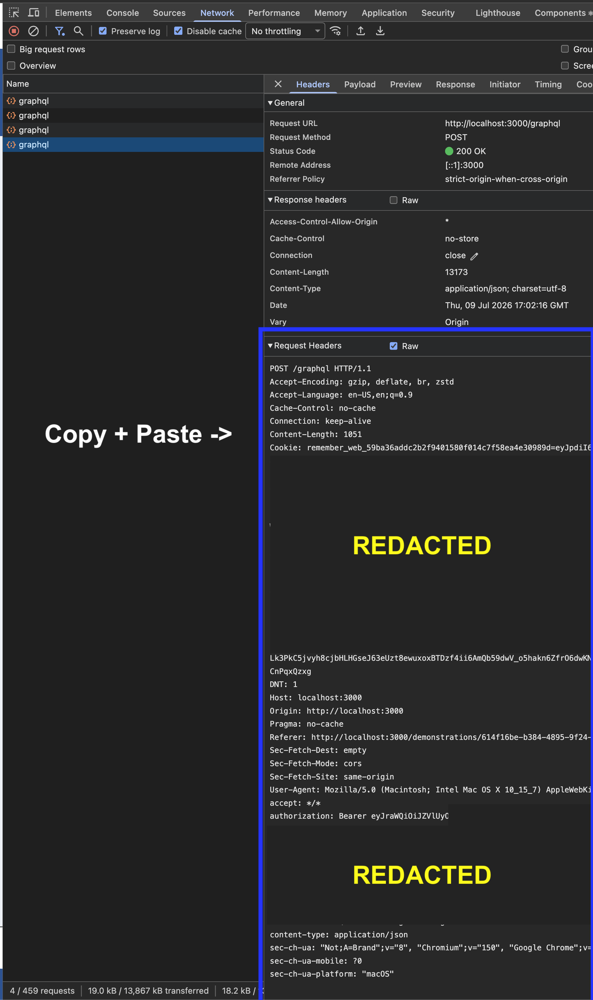

# Create Approved Demo API Script

This local helper creates an approved demonstration through the local GraphQL API, with a few local DB updates for setup and phase transitions that are not available through GraphQL.

## Setup

Copy `.env.example` to `.env` in this directory and fill in the local values:

- `DATABASE_URL`: local demos database connection string.
- `APPROVED_DEMO_GRAPHQL_ENDPOINT`: local GraphQL endpoint, usually `http://localhost:4000/graphql`.
- `APPROVED_DEMO_PROJECT_OFFICER_USER_ID`: an existing CMS user/person id that has at least one row in `demos_app.person_state`.
- `UPLOAD_BUCKET`, `CLEAN_BUCKET`, `DELETED_BUCKET`, `S3_ENDPOINT_LOCAL`: local S3/LocalStack settings.

## Auth

The script reads `cookie.txt`, extracts the `id_token` cookie, and writes it to `.env` as `APPROVED_DEMO_ID_TOKEN` before running.

To refresh `cookie.txt`:

1. Log in to the local DEMOS app.
2. Open browser devtools and go to Network.
3. Create or update something so a `POST /graphql` request is sent.
4. Select that request, open the Headers tab, and enable `Raw` for Request Headers.
5. Copy the complete Request Headers block.
6. Replace the non-comment content in `cookie.txt` with the complete Request Headers block.



The pasted block should include the request line and headers, including `Cookie`:

```text
POST /graphql HTTP/1.1
Accept-Encoding: gzip, deflate, br, zstd
...
Cookie: remember_web_...=<value>; id_token=<jwt>; access_token=<jwt>
...
```

Do not commit real cookie, `id_token`, `access_token`, or `authorization` values.

## Run

From the `scripts` directory:

```sh
npm run create:demo
```

If the script fails with `No values available to pick state`, the configured project officer id does not have any state rows:

```sql
select *
from demos_app.person_state
where person_id = '<APPROVED_DEMO_PROJECT_OFFICER_USER_ID>';
```

Use a project officer with existing states, or add a local `person_state` row for the user before rerunning.
